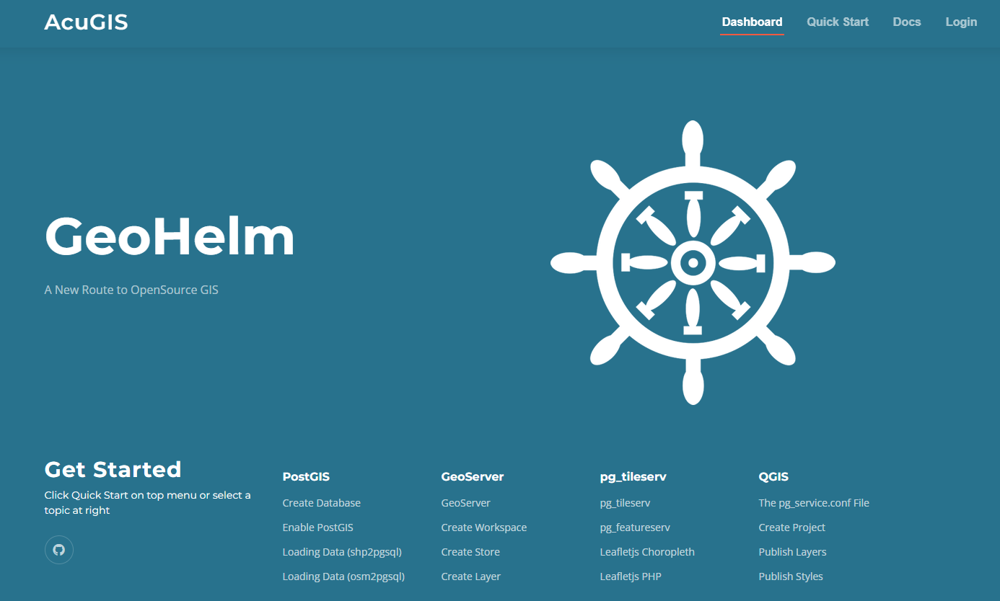
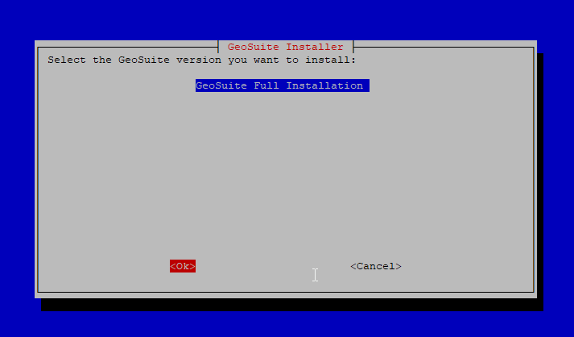
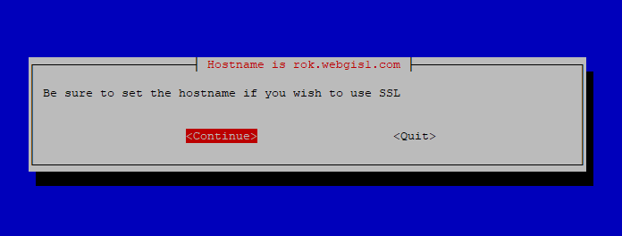
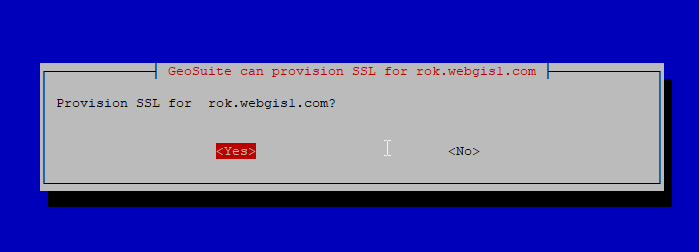
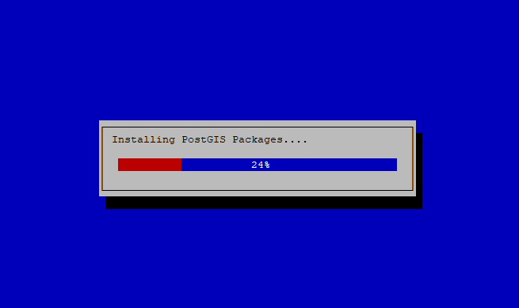

# GeoHelm: Open Source GIS Suite

GeoHelm installs, configures, and manages the <code>latest, stable</code> versions of:

<code>Apache Tomcat</code> 
<code>OpenJDK</code> 
<code>GeoServer</code> 
<code>PostgreSQL</code> 
<code>PostGIS</code> 
<code>PgRouting</code> 
<code>pg_tileserv</code> 
<code>pg_featurserv</code> 

It also provides browser-based management for all services (see screen shot below)

All software installed by GeoSuite is unmodified, so it does not limit, change, or impede normal SSH access or require specific usage.   

The control panel and modules can be uninstalled and all components will continue to run. 

## Supported Operating Systems  
		
<code>Ubuntu 22 LTS</code> 
<code>Rocky Linux 9</code>

## System Requirements:  
Disk: <code>10 GB</code> 
Memory: <code>2 GB (Minimum) </code>  

## Installation

1. On a clean Ubuntu 22 or Rocky Linux 9 system, run below as root to launch the Installer::

      	wget https://raw.githubusercontent.com/AcuGIS/GeoSuite/master/scripts/geohelm-installer.sh && chmod +x geohelm-installer.sh && ./geohelm-installer.sh

2.  Select "Full Installation" and tab to OK

3.  The Installer will prompt to check hostname and if you wish to enable SSL

3.  The Installer will prompt if you wish to enable SSL

Installation time on Ubuntu 22 is about 4 minutes.  Installation time on Rocky Linux can take up to 15 minutes due to required source build for osm2pgsql

On completetion, below is displayed::

		Installation is now completed.
		Access pg-tileserv at rok.webgis1.com:7800
		Access pg-featureserv at rok.webgis1.com:9000
		postgres, Tomcat, and crunchy pg passwords are saved in /root/auth.txt file
		SSL Provisioning Success.

4. Click the Login link on the homepage to access the control panel.

## Documentation
GeoSuite Documentation is available at [GeoHelm Docs](https://www.acugis.com/geohelm/docs/)

[AcuGIS](https://www.acugis.com/), [GeoHelm](https://geohelm.org) &copy; 2023 [Cited, Inc. ](https://www.citedcorp.com)Cited, Inc. All Rights Reserved.
