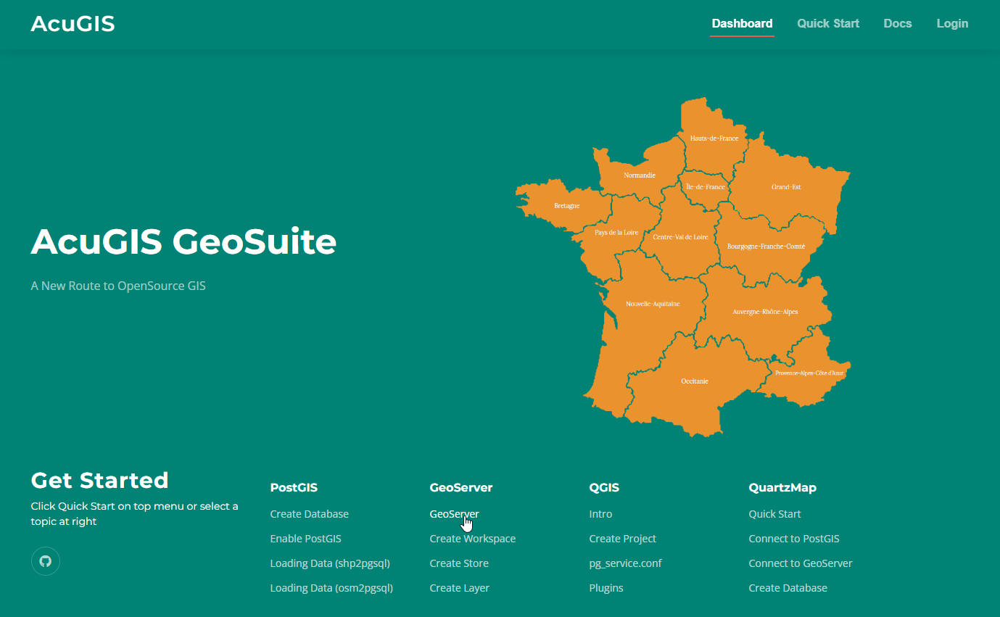
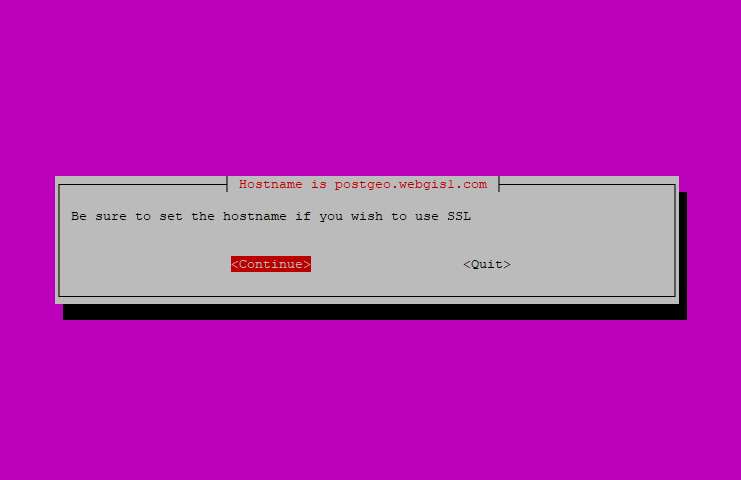
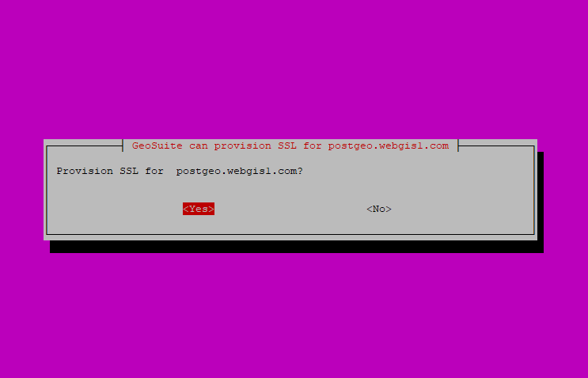
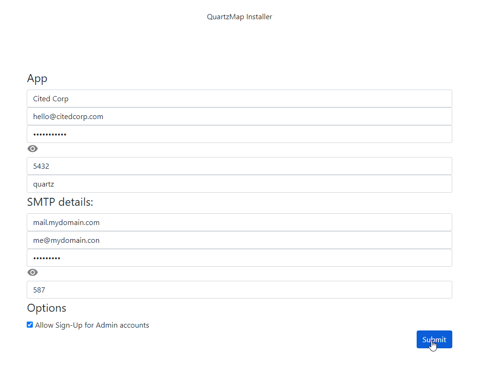

# GeoSuite: Open Source GIS Suite

GeoSuite installs, configures, and manages the <code>latest, stable</code> versions of:

<code>Apache Tomcat</code> 
<code>GeoServer</code> 
<code>PostgreSQL</code> 
<code>PostGIS</code> 
<code>PgRouting</code> 
<code>QGIS Server</code> 
<code>QuartzMap</code> 

It also provides browser-based management for all services (see screen shot below)

All software installed by GeoSuite is unmodified, so it does not limit, change, or impede normal SSH access or require specific usage.   

The control panel and modules can be uninstalled and all components will continue to run. 

## Supported Operating Systems  
		
<code>Ubuntu 22 LTS</code> 
<code>Ubuntu 24 LTS</code>

## System Requirements:  
Disk: <code>15 GB</code> 
Memory: <code>2 GB (Minimum) </code>  

## Installation

1. On a clean Ubuntu 22 or 24 system, run below as root to launch the Installer::

      	wget https://raw.githubusercontent.com/AcuGIS/GeoSuite/master/scripts/geosuite-installer.sh && chmod +x geosuite-installer.sh && ./geosuite-installer.sh

2.  Select "GeoSuite Only" or "GeoSuite and QuartzMap" and tab to OK

3.  The Installer will prompt to check hostname and if you wish to enable SSL

3.  The Installer will prompt if you wish to enable SSL

Installation time on Ubuntu 24 is about 4 minutes without QuartzMap and up to 10 minutes with QuartzMap.  

On completetion, below is displayed::

		Installation is now completed.
		postgres, Tomcat, and crunchy pg passwords are saved in /root/auth.txt file
		SSL Provisioning Success.

4. Click the Login link on the homepage to access the control panel.

5. If you elected to enable QuartzMap, go to https://yourdomain.com/quartzmap/admin/setup.php and enter your information

## Documentation
GeoSuite Documentation is available at [GeoSuite Docs](https://geosuite.docs.acugis.com)

[AcuGIS](https://www.acugis.com/), &copy; 2024 [Cited, Inc. ](https://www.citedcorp.com)Cited, Inc. All Rights Reserved.
