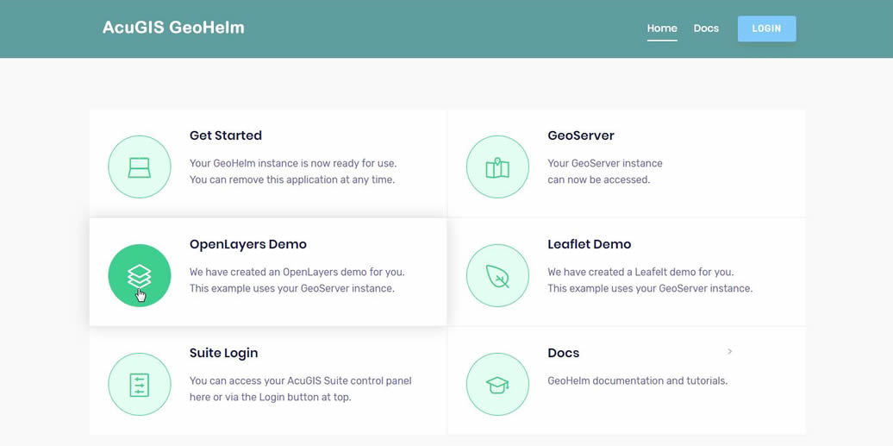

# GeoHelm: A new route to Open Source GIS

* Project page: https://www.acugis.com/geohelm
* Documentation: https://geohelm.docs.acugis.com 

GeoHelm is a Webmin module that installs, configures, and manages the <code>latest, stable</code> versions of:

<code>Apache Tomcat</code> 
<code>Oracle Java or OpenJDK</code> 
<code>PostgreSQL</code> 
<code>PostGIS</code> 
<code>PgRouting</code> 
<code>GeoServer</code> 

It also provides browser-based management for all services (see screen shot below)

All software installed by GeoHelm is unmodified, so it does not limit, change, or impede normal SSH access or require specific usage.   

The entire module can even be uninstalled and all components will continue to run. 

## Supported Operating Systems  
		
<code>CentOS 7</code> 
<code>Ubuntu 18 LTS</code> 

## System Requirements:  
Disk: <code>10 GB</code> 
Memory: <code>1 GB (Minimum) </code>  
User Access:<code>root access required</code> 
Software Requirements: <code>Webmin</code> 

# Install via Script:

      wget https://raw.githubusercontent.com/AcuGIS/GeoHelm/master/scripts/pre-install.sh
      chmod +x pre-install.sh
      ./pre-install.sh

Go to Webmin > Servers > GeoHelm to complete installation using the Wizard

# Install via Git:

Archive module

	$ git clone https://github.com/AcuGIS/GeoHelm
	$ mv GeoHelm-master geohelm
	$ tar -cvzf geohelm.wbm.gz geohelm/

Upload from Webmin->Webmin Configuration->Webmin Modules

Go to Webmin > Servers > GeoHelm to complete installation using the Wizard

## Documentation
GeoHelm Documentation is available at [GeoHelm Docs](https://www.acugis.com/geohelm/docs/)
		
## GeoHelm Installed:

[AcuGIS](https://www.acugis.com/), [GeoHelm](https://geohelm.org) &copy; 2019 [Cited, Inc. ](https://www.citedcorp.com)Cited, Inc. All Rights Reserved.
