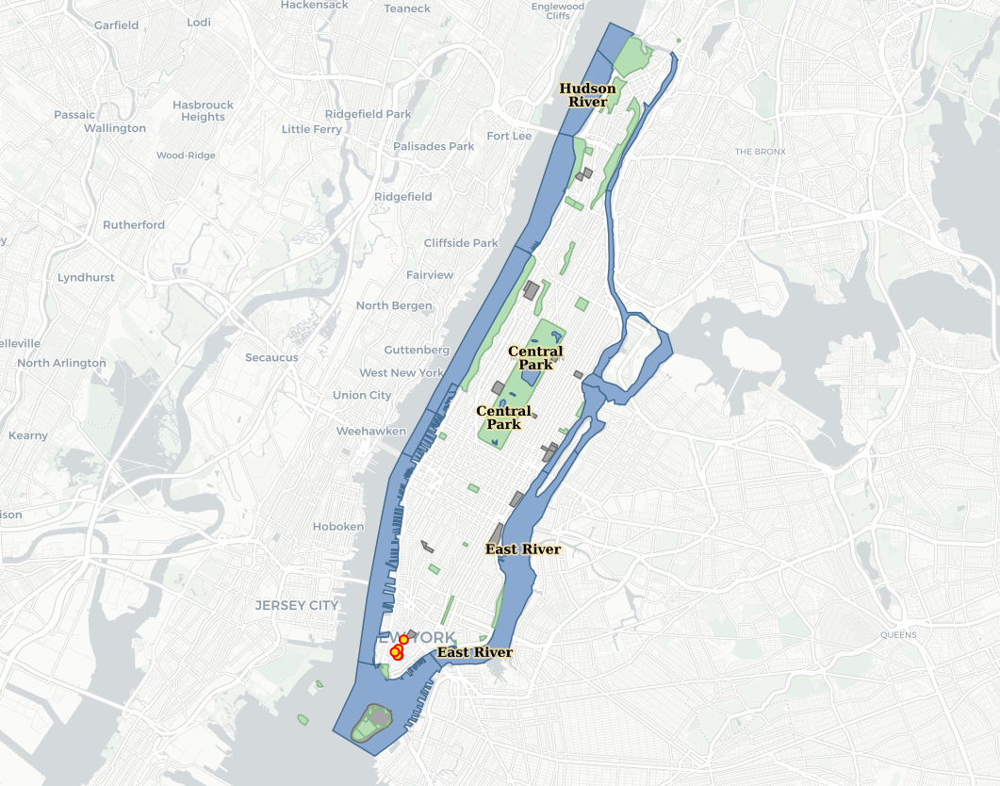

.. _jri-label:
.. This is a comment. Note how any initial comments are moved by
   transforms to after the document title, subtitle, and docinfo.

.. demo.rst from: http://docutils.sourceforge.net/docs/user/rst/demo.txt

.. |EXAMPLE| image:: static/yi_jing_01_chien.jpg
   :width: 1em

**********************
BetterWMS
**********************

.. contents:: Table of Contents

About
=================

BetterWMS is the simplest javascript for getting your GeoServer layers online with feature info available.

It uses  https://gist.github.com/alfredotranchedone/72326145ecff5d7d7233

It can be access via

   http://domain.com/BetterWMS.html
   

Usage
=================

Navigate to http://domain.com/BetterWMS.html and the app will appear as shown below:

Click on the Layer to view the getFeature info for the State.

You can add any number of layers by simply adding below:

.. code-block:: console
   :linenos:

		L.tileLayer.betterWms(url, {
        		layers: 'tiger:poi',
        		transparent: true,
        		format: 'image/png'
      		}).addTo(map);
		
Structure
=============

The app is located at::

	/vaw/www/html/betterWMS.html
		
Content
=========

The content of the html page is displayed below.

.. code-block:: console
   :linenos:

	<!doctype html>
	<html>
  	<head>
   	 <title>WMS GetFeatureInfo</title>
    	<link rel="stylesheet" href="http://cdn.leafletjs.com/leaflet-0.6.4/leaflet.css" />
    	<!--[if lte IE 8]>
        	<link rel="stylesheet" href="http://cdn.leafletjs.com/leaflet-0.6.4/leaflet.ie.css" />
    	<![endif]-->
    
    	
    	
  	</head>
  	<body>
   	 

    
    	
    	
    	
  	</body>
	</html>

Documentation
==============
https://leafletjs.com/

https://leafletjs.com/examples/geojson/
   
