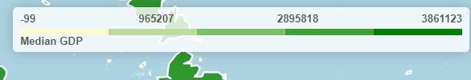
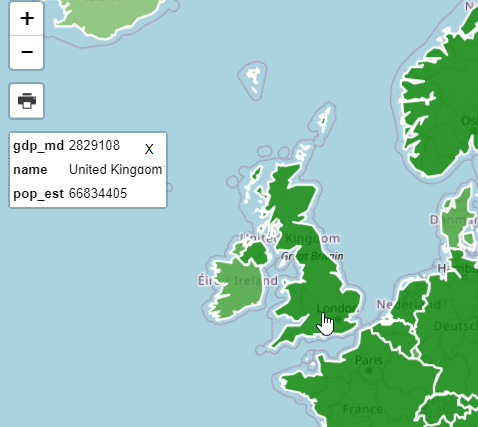
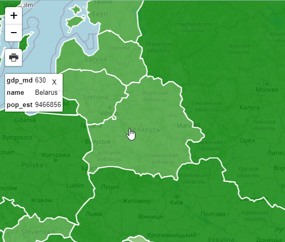
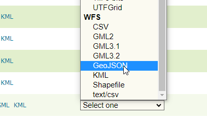
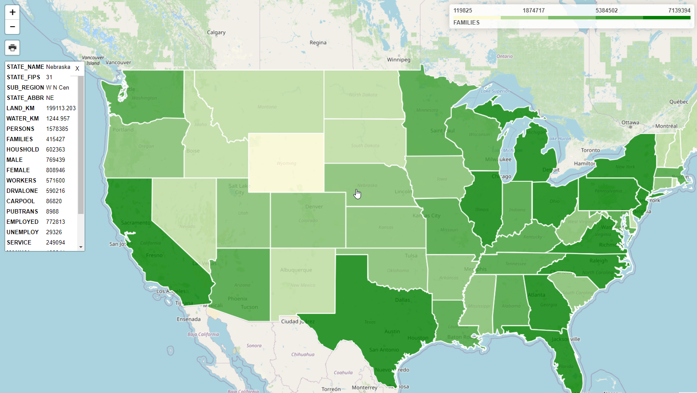

**********************
Leaflet Choropleth App
**********************

.. contents:: Table of Contents

Intro
=================

GeoSuite includes a Leaflet Choropleth map using your pg_featurserv installation

The map can be access via:

	http://domain.com/LeafletChoropleth.html

It should appear as below:

.. image:: _static/ChoroplethApp.png

.. image:: _static/spacer.png

This map uses Leafletjs and the Leaflet Choropleth Plugin:

	https://github.com/timwis/leaflet-choropleth

Choropleth Maps
=================

A Choropleth map renders coloring based on user defined ranges.

In the demo map, GDP is used to determine country coloring.

At top right, a legend is displayed that shows the color range

.. image:: _static/spacer.png

This metric we are using (gdp_md), along with the color and steps between is passed via the choroplethLayer as below:

.. code-block:: console

	// Add GeoJSON
                $.getJSON(full_url, function (geojson) {
                  var choroplethLayer = L.choropleth(geojson, {
                    valueProperty: 'gdp_md',
                    scale: ['#fbfad4', 'green'],
                    steps: 5,
                    mode: 'q',
                    style: {
                      color: '#fff',
                      weight: 2,
                      fillOpacity: 0.8

The js for our Legend is below and updating the choropleth metric requires only updating the display name:

.. code-block:: console

	// Add legend
                  var legend = L.control({ position: 'topright' })
                  legend.onAdd = function (map) {
                    var div = L.DomUtil.create('div', 'info legend')
                    var limits = choroplethLayer.options.limits
                    var colors = choroplethLayer.options.colors
                    var labels = []
                
                    // Add min & max
                    div.innerHTML = `
                        

                            
` + limits[0] + `

                            
` + Math.round(((limits[limits.length - 1]-limits[0])*.25)+limits[0]) + `

                            
` + Math.round(((limits[limits.length - 1]-limits[0])*.75)+limits[0]) + `

                			
` + limits[limits.length - 1] + `

                		
`
                
                    limits.forEach(function (limit, index) {
                      labels.push('<li style="background-color: ' + colors[index] + '"></li>')
                    })
                
                    div.innerHTML += '<ul>' + labels.join('') + '</ul> '+humanize('Median GDP')+''
                    
                    return div 
                  }
                  legend.addTo(map);
                });

featuresrv URL
=================

If you need to change the url for any reason, go to /var/www/html/LeafletChoroDemo.html and edit line 155:

.. code-block:: console

	var full_url = "https://<YourIP>:9001/collections/public.countries/items.json?limit=100&continent=Europe";
	
Change <YourIP> to your server IP or hostname.

Note: If you are not using SSL, update the line to use 'HTTP' and port to 9000	

Querying Features
================= 

In our demo app, we are only limiting the number of items retured (100) and the continent (Europe):

.. code-block:: console

                var full_url = "http://carmen.webgis1.com:9000/collections/public.countries/items.json?limit=100&continent=Europe";

As you can see, this results in a large number of Properies being displayed on click.

We can change this using the pg_featurserv query parameters.

Let's add below to limit the Properties displayed to country name, estimated population, and gdp:

.. code-block:: console

	&properties=name,pop_est,gdp_md

Our url now becomes:

.. code-block:: console

	var full_url = "http://carmen.webgis1.com:9000/collections/public.countries/items.json?limit=100&continent=Europe&properties=name,pop_est,gdp_md";

Clicking on the map, the properties now becomes more manageable:

.. image:: _static/spacer.png

Relative Values
================= 

It's important to note that while properties are the value from the database the Choropleth function shows values relative to our query.

.. code-block:: console

                var full_url = "http://carmen.webgis1.com:9000/collections/public.countries/items.json?limit=100&continent=Europe&properties=name,pop_est,gdp_md";

If we look at the shading for Belarus, for example, it's GDP is rendered relative to the items (Europe, in our case)

.. image:: _static/belarus.png

.. image:: _static/spacer.png

Let's now change our Query to remove '&continent=Europe' and increase the limit to 500 to include all countries

.. code-block:: console

                var full_url = "http://carmen.webgis1.com:9000/collections/public.countries/items.json?limit=500&properties=name,pop_est,gdp_md";

As we can see, the GDP for Belarus relative to the world (and not just Europe) shows a deeper shade of green,as do the other countries of Europe as we are now seeing GDP relative to all countries and not just Europe.

.. image:: _static/spacer.png

Print
=================

Printing for the demo app is enabled by the leaflet.browser.print plugin:

	https://github.com/Igor-Vladyka/leaflet.browser.print

The print plugin offers Portrait, Landscape, Auto, and Custom options

**1.  Click the print icona and select Auto**

.. image:: _static/print.png

.. image:: _static/spacer.png

**2. On click a new window will open atop the current window as below.  Select "Save as PDF" from the dropdown.**

.. image:: _static/print-page.png

.. image:: _static/spacer.png

**3. Depending on your device, you may have additional print/save options as well**

.. image:: _static/print-options.png

.. image:: _static/spacer.png

Using GeoServer
================

As you may have noticed, our map requires only a json feed.

In the demo, we are using pg_featurserv, but we can change this to GeoServer with 3 simple changes:

**1. In your GeoServer instance, go to Layer Preview and select GeoJson under WFS for the USA Popular layer**

.. image:: _static/spacer.png

**2. Substiture the full url for pg_featurserv url**

.. code-block:: console

	var full_url = "http://domain.com/geoserver/topp/ows?service=WFS&version=1.0.0&request=GetFeature&typeName=topp:states&maxFeatures=50&outputFormat=application/json";

**3. Update line 159 to FAMILIES**

.. code-block:: console

	valueProperty: 'FAMILIES',

**4. Update line 208 to FAMILIES**

.. code-block:: console

	div.innerHTML += '<ul>' + labels.join('') + '</ul> '+humanize('FAMILIES')+''

**5. Refreshing the page should now show our USA Population layer with FAMILIES as you metric:**

.. image:: _static/spacer.png

Documentation
==============
https://access.crunchydata.com/documentation/pg_featureserv/latest/

https://github.com/timwis/leaflet-choropleth

https://github.com/CrunchyData/pg_featureserv

   
