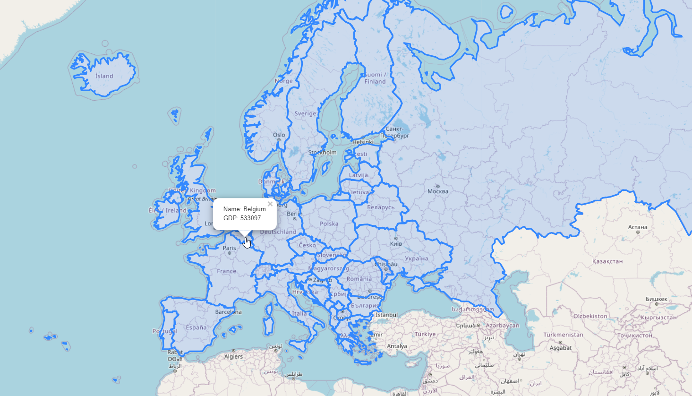

**********************
Leaflet and PHP
**********************

.. contents:: Table of Contents

Access
=================

A web application employing PostGIS, PHP, and LeafletJS.

This application uses the PHP-Database-GeoJSON file from https://github.com/bmcbride/PHP-Database-GeoJSON

It can be access via http://domain.com/LeafletPHPDemo.html

 
   

Initialize
=================

If you any issues connecting to PostGIS, check line 12 of get-json.phpbelow:

	$conn = new PDO('pgsql:host=localhost;dbname=postgisftw','pgis','<YourPgisPassword>');
	
Replace <YourPgisPassword> with the password for user pgis.

The password for user pgis is auto-generated and can be found at /home/pgis/.pgpass

Security
=================

This map loads GeoJson generated from PostGIS directly and does not employ the pg_featurserv or GeoServer urls.

As you may have noticed, it is identical to our LeafletGeoJson.html map except for the GeoJson source url.

While urls for pg_featurserv and GeoServer can be secured, the url will always be exposed to your users as it is required for map rendering.

Conversely, the PostGIS PHP application uses the get-json.php file to establish a connection to PostGIS in the background.

You can employ the same method for loading GeoJson from pg_featurserv, GeoServer, or any other json url.

There is performance penalty, however, as the GeoJson is loaded into the end users browser and for large data sets, this can become extremely slow.

Structure
=============

The app is located at::

	/vaw/www/html/LeafletPHPDemo.html
		
This is just a basic Leafletjs map in which we are pulling in geojson from get-json.php::

	$.getJSON("get-json.php", function(data) {
	

Content
=========

The content of the html page is displayed below.

.. code-block:: console
   :linenos:

	<!doctype html>
	<html>
	<head>
  	

	<link rel="stylesheet" href="https://unpkg.com/leaflet@1.1.0/dist/leaflet.css"
   	integrity="sha512-wcw6ts8Anuw10Mzh9Ytw4pylW8+NAD4ch3lqm9lzAsTxg0GFeJgoAtxuCLREZSC5lUXdVyo/7yfsqFjQ4S+aKw=="
   	crossorigin=""/>

    	
  	</head> 
  
	
	</head>
	<body>
  	

  	

	</body>
	</html>

Documentation
==============
https://leafletjs.com/

https://leafletjs.com/examples/geojson/
   
