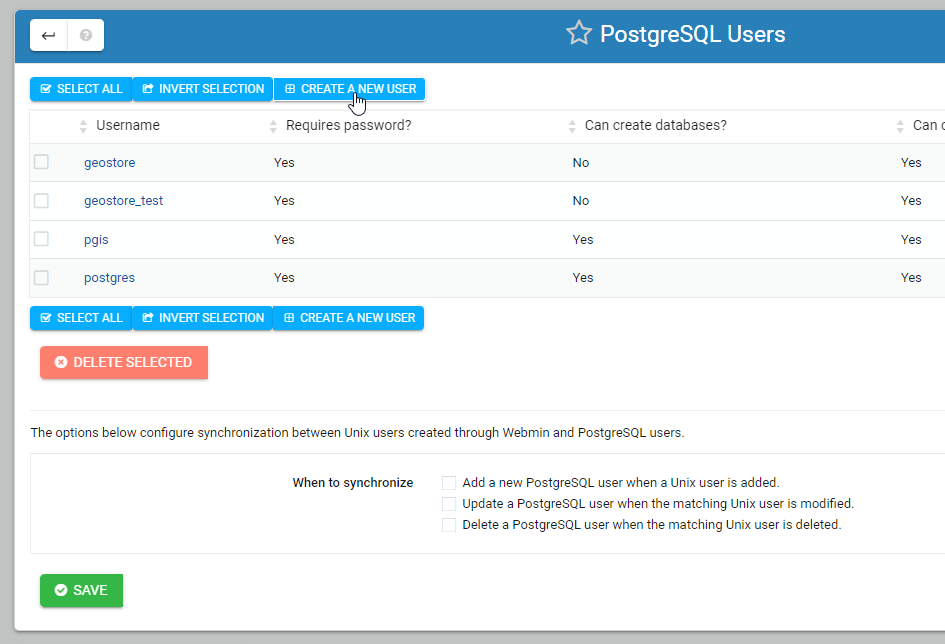

**********************
Create Database
**********************

.. contents:: Table of Contents

The geodb Database
=========================

We will be using the geodb database throughout these docs and tutorials.

We'll see how to create the database and user using psql as well as the control panel and PgAdmin.

You can use any PostGIS enabled database, or give your database any other name you wish to.

Create a User
==================

To create a PostgreSQL user, connect to psql

.. code-block:: bash

		root@demo:~# su - postgres
		postgres@lizmap-demo:~$ psql
		psql (15.3 (Ubuntu 15.3-1.pgdg22.04+1))
		Type "help" for help.
		postgres=# 
	
Issue the CREATE USER command and supply a password:

.. code-block:: bash

	postgres=# CREATE USER geouser WITH PASSWORD 'SecretPassword';
	
	
Replace SecretPassword above with a secure password.

Create a Database
==================

To create our PostgreSQL database, geodb, connect to psql

.. code-block:: bash

		postgres@demo:~$ psql
		postgres=# 
	
We'll now create the database with the CREATE DATABASE command and give ownership to user we created above:

.. code-block:: bash

	
	postgres=# CREATE DATABASE geodb WITH OWNER = geouser;

The above will create our database as well as give ownership of the database to user geouser   
   
List Databases
==================

We can list all databases by connecting as postgres and issuing \\l

.. code-block:: bash

   
   	postgres@demo:~$ psql
	psql (15.3 (Ubuntu 15.3-1.pgdg22.04+1))
	Type "help" for help.
	postgres=# \l
                                              	List of databases
    	Name    |  Owner   | Encoding | Collate |  Ctype  | ICU Locale | Locale Provider |   Access privileges
	------------+----------+----------+---------+---------+------------+-----------------+-----------------------
 	geostore   | postgres | UTF8     | C.UTF-8 | C.UTF-8 |            | libc            |
 	geodb   | geouser | UTF8     | C.UTF-8 | C.UTF-8 |            | libc            |
	postgisftw | pgis     | UTF8     | C.UTF-8 | C.UTF-8 |            | libc            |
	postgres   | postgres | UTF8     | C.UTF-8 | C.UTF-8 |            | libc            |
 	template0  | postgres | UTF8     | C.UTF-8 | C.UTF-8 |            | libc            | =c/postgres          +
            |          |          |         |         |            |                 | postgres=CTc/postgres
 	template1  | postgres | UTF8     | C.UTF-8 | C.UTF-8 |            | libc            | =c/postgres          +
            |          |          |         |         |            |                 | postgres=CTc/postgres
	(5 rows)

	(END)
	

Connect to Database
====================

To connect to our PostgreSQL database, geodb, connect to psql

.. code-block:: bash

		postgres@demo:~$ psql
		postgres=# 
	
Use \\c to connect to the database

.. code-block:: bash
		
		postgres=# \c geodb
		You are now connected to database "geodb" as user "postgres".
	
	
	
List Tables
====================

To list all relations in a database, connect to the database and use \\dt

.. code-block:: bash

		postgres=# \c geodb
		postgres=# \dt
		Did not find any relations.

Since we just created our database and have not created any tables, no relations are found.

Let's connect to the postgisftw database created when we installed pg_tileserv.

.. code-block:: bash

	postgres=# \c postgisftw
	You are now connected to database "postgisftw" as user "postgres".
	
Now, list the relations using \\dt
	
.. code-block:: bash
   
	postgisftw=# \dt
        	       List of relations
 	Schema |       Name        | Type  |  Owner
	--------+-------------------+-------+----------
 	public | configuration     | table | pgis
 	public | countries         | table | pgis
 	public | pointsofinterest  | table | pgis
 	public | spatial_ref_sys   | table | postgres
 	public | ways              | table | pgis
 	public | ways_vertices_pgr | table | pgis
	(8 rows)

	postgisftw=#

We've now seen how to create a PostgreSQL database and user, as well as how to connect to our database and list relations

Create Using the Control Panel
===================================

We'll now see how to create our user and database via the control panel.

Begin by clicking "PostgreSQL Database Server" on the left menu

**1. Click the "PostgreSQL Users" icon as show below**

.. image:: 1-Create-DB-user.png
   :width: 100 %

.. image:: spacer.png

**2. Click the "Create New User" button as show below**

   
.. image:: spacer.png

**3. For the usrname, enter geouser, for the password enter a secure password.**

**4. Click the "Create" button**

.. image:: 3-Create-DB-user-3.png
   :width: 100 %
   
.. image:: spacer.png

**5. Back on the main PostgreSQL Database menu, click the "Create a New Database" button**

.. image:: 4-Create-DB-panel-1.png
   :width: 100 %
   
.. image:: spacer.png

**6. For the database name, enter geodb and select the user we created (geouser) from the dropdown for Database Owner.**

**7. Click the Create button**

.. image:: 5-Create-DB-panel-2.png
   :width: 100 %
   
.. image:: spacer.png

**The database should now appear in the main PostgreSQL section.**

.. image:: 6-view-database.png
   :width: 100 %
   
.. image:: spacer.png

We've now used the control panel to create a PostgreSQL user and database.

