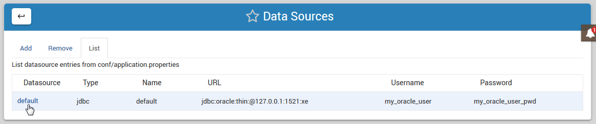
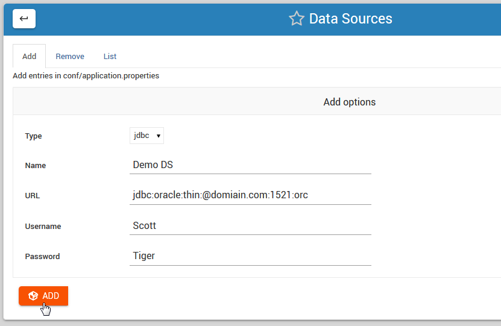
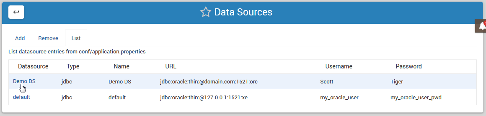
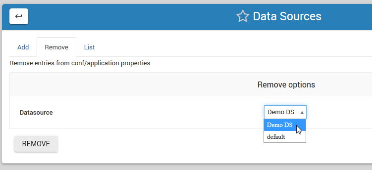

.. This is a comment. Note how any initial comments are moved by
   transforms to after the document title, subtitle, and docinfo.

.. demo.rst from: http://docutils.sourceforge.net/docs/user/rst/demo.txt

.. |EXAMPLE| image:: static/yi_jing_01_chien.jpg
   :width: 1em

**********************
Data Sources
**********************

.. contents:: Table of Contents
Data Source Types
=================

Data Sources are used to connect your Oracle database.

JRI Publisher supports both JDBC and JNDI Data Source types included with JRI.

JDBC Data Sources are stored in a flat file at::

    ${CATALINA_HOME}/jasper_reports/conf/
   
JDBC Data Sources have the following form::

   #====================================================================
   # JDBC datasource configuration
   # http://www.orafaq.com/wiki/JDBC#Thin_driver
   # additional jdbc configurations, please uncomment
   #====================================================================
   [datasource:test]
   name=test
   url=jdbc:oracle:thin:@127.0.0.1:1521:XE
   username=my_oracle_user
   password=my_oracle_user_pwd

JNDI Data Sources are stored in a database and referenced in the application server rather than stored in a flat file as with JDBC Data Sources.

JNDI Data Sources have the following form::

   #====================================================================
   # Native JNDI datasource, to be configured in the application server
   # name: jndi_test
   #====================================================================
   [datasource:jndi_test]
   type=jndi
   name=jndi_test

Working with Data Sources
=========================

Data Sources can be added, edited and removed from the JRI Publisher Module via the Data Source tab, as shown below

.. image:: _static/data-source-tab.png

The default view on clicking the tab is the List view, as shown below.

To add a Data Source, click on the Add tab at top.

Select the desired Data Source type and enter the required information as shown below. Then click the Add button:

On the main Data Source tab we can confirm the Data Source has been added:

To remove a Data Source, click on the Remove tab and select the Data Source you wish to remove using the drop-down selector as shown below:

