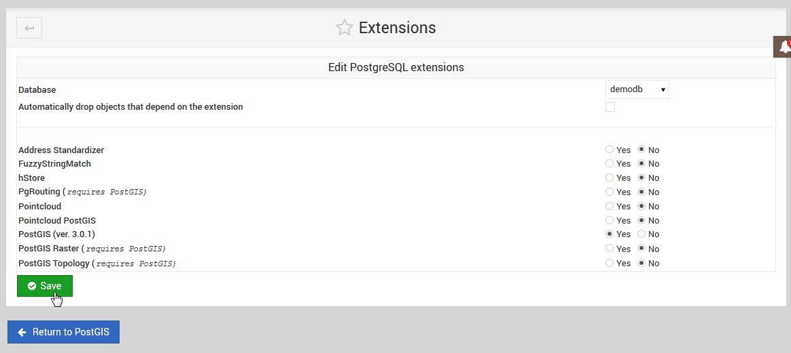

.. This is a comment. Note how any initial comments are moved by
   transforms to after the document title, subtitle, and docinfo.

.. demo.rst from: http://docutils.sourceforge.net/docs/user/rst/demo.txt

.. |EXAMPLE| image:: static/yi_jing_01_chien.jpg
   :width: 1em

**********************
PostGIS
**********************

.. contents:: Table of Contents

Installing PostGIS
==================

PostGIS can be enabled on your PostgreSQL database via the Extension tab or via Command Line.

Command Line
============

To install via command line:

1. Connect to PostgreSQL

.. code-block:: console

   root@postgis:~# su - postgres
   postgres@postgis:~$ psql
   psql (15.3 (Ubuntu 15.3-1.pgdg22.04+1))
   Type "help" for help.

   postgres=#

 

2. Connect to target database.

.. code-block:: console

   postgres=# \c demodb
   You are now connected to database "demodb" as user "postgres".
   demodb=#

3. Install the PostGIS extension.

.. code-block:: console

   demodb=# create extension postgis;
   CREATE EXTENSION
   demodb=#

.. Note::

You can install includes fuzzy_match_string, tiger, postgis_topology, postgis_raster using above.

 
4. Verify the installation via command line or the PostgreSQL Management Page

.. code-block:: console

   demodb=# \d
               List of relations
   Schema |       Name        | Type  |  Owner
   --------+-------------------+-------+----------
   public | geography_columns | view  | postgres
   public | geometry_columns  | view  | postgres
   public | raster_columns    | view  | postgres
   public | raster_overviews  | view  | postgres
   public | spatial_ref_sys   | table | postgres
   (5 rows)

 
Extensions Tool
===============

To install using the PostGIS/PgRouting Extension installer, click on the Extensions tab as shown below.

.. image:: _static/postgis-tab.png

1. Select the target database from the drop-down as shown below.

.. image:: _static/postgis-select-db.png 

.. Note:: You must FIRST install PostGIS prior to installing any other of the listed extensions.

2. Tick the PostGIS select button and then click the Save button as show below:

 
3. Once PostGIS has been installed on a target database, you can then return to install additional extensions:

.. image:: _static/postgis-install-others.png
	
.. Note:: 
   You can also un-install Extensions using above. 

