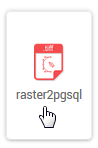
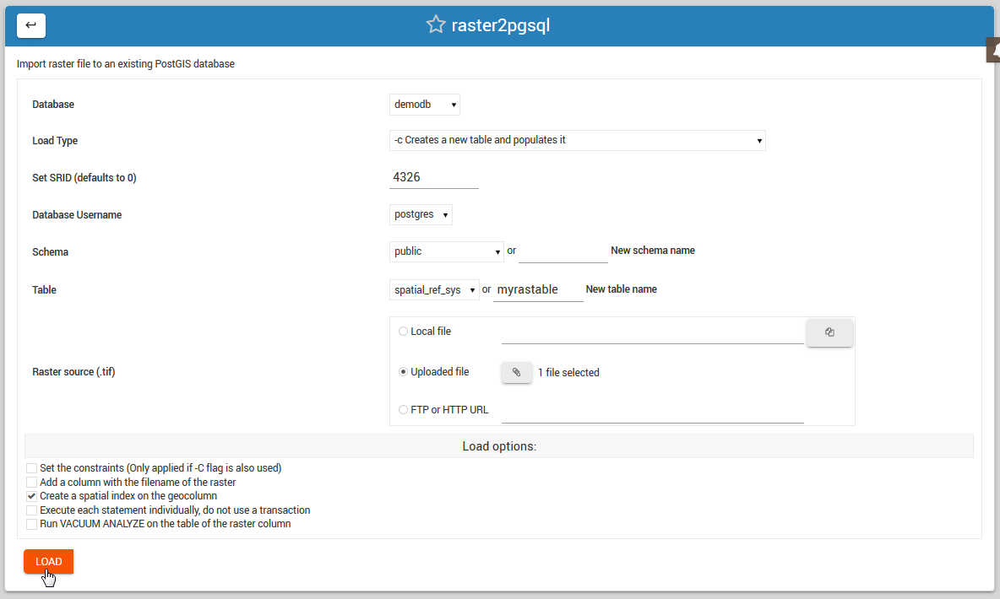

.. This is a comment. Note how any initial comments are moved by
   transforms to after the document title, subtitle, and docinfo.

.. demo.rst from: http://docutils.sourceforge.net/docs/user/rst/demo.txt

.. |EXAMPLE| image:: static/yi_jing_01_chien.jpg
   :width: 1em

**********************
raster2pgsql
**********************

.. contents:: Table of Contents

Create Extension
====================
In order to use raster2pgsql, either by command line or the control panel, you will need to create the postgis_raster extension

su to postgres

.. code-block:: console

   root@demo:# su - postgres
  
Start psql

.. code-block:: console

   postgres@demo:~$ psql
   psql (15.3 (Ubuntu 15.3-1.pgdg22.04+1))
   Type "help" for help.

Connect to target database (in this case, postgisftw)

.. code-block:: console

   postgres=# \c postgisftw
   You are now connected to database "postgisftw" as user "postgres".

Issue the create extension command

.. code-block:: console

   postgisftw=# create extension postgis_raster;
   CREATE EXTENSION
   postgisftw=#

raster2pgsql Loader
====================

An included raster2pgsql tool is available if you installed Webmin.

There are 2 options for loading raster files:

1. Load using the raster2pgsql File Loader.

2. Load using raster2pgsql via command line.

Load via raster2pgsql Loader
============================

Click the Shape File Loader tab as shown below

The load options are displayed below.

Also select if load will be into a new Schema and, in the case of New Table creation, the table name to be created.

**Load Options**

Database: select the database you wish to load the shape file to.

Load Type: Create, Drop, Append, or Prepare

Set SRID: Defaults to 0 if not set

Database Username:  Select the user who will own the data

Schema: Select an existing schema or create a new schema.

Table: Select an existing table or create new one

Raster File Source:  Local, Upload, or FTP/HTTP

Load via Comamnd Line
=====================
 
Usage

raster2pgsql usage can be found using the 'raster2pgsql' command.

.. code-block:: console

   [root@postgis ~]# raster2pgsql
   RELEASE: 3.0.1 GDAL_VERSION=30 (ec2a9aa)
   USAGE: raster2pgsql [<options>] <raster>[ <raster>[ ...]] [[<schema>.]<table>]
   Multiple rasters can also be specified using wildcards (*,?).

   OPTIONS:
   -s <srid> Set the SRID field. Defaults to 0. If SRID not
     provided or is 0, raster's metadata will be checked to
     determine an appropriate SRID.
   -b <band> Index (1-based) of band to extract from raster. For more
      than one band index, separate with comma (,). Ranges can be
      defined by separating with dash (-). If unspecified, all bands
      of raster will be extracted.
   -t <tile size> Cut raster into tiles to be inserted one per
      table row. <tile size> is expressed as WIDTHxHEIGHT.
      <tile size> can also be "auto" to allow the loader to compute
      an appropriate tile size using the first raster and applied to
      all rasters.
   -P Pad right-most and bottom-most tiles to guarantee that all tiles
     have the same width and height.
   -R  Register the raster as an out-of-db (filesystem) raster. Provided
      raster should have absolute path to the file
   (-d|a|c|p) These are mutually exclusive options:
     -d  Drops the table, then recreates it and populates
         it with current raster data.
     -a  Appends raster into current table, must be
         exactly the same table schema.
     -c  Creates a new table and populates it, this is the
         default if you do not specify any options.
     -p  Prepare mode, only creates the table.
   -f <column> Specify the name of the raster column
   -F  Add a column with the filename of the raster.
   -n <column> Specify the name of the filename column. Implies -F.
   -l <overview factor> Create overview of the raster. For more than
      one factor, separate with comma(,). Overview table name follows
      the pattern o_<overview factor>_<table>. Created overview is
      stored in the database and is not affected by -R.
   -q  Wrap PostgreSQL identifiers in quotes.
   -I  Create a GIST spatial index on the raster column. The ANALYZE
      command will automatically be issued for the created index.
   -M  Run VACUUM ANALYZE on the table of the raster column. Most
      useful when appending raster to existing table with -a.
   -C  Set the standard set of constraints on the raster
      column after the rasters are loaded. Some constraints may fail
      if one or more rasters violate the constraint.
   -x  Disable setting the max extent constraint. Only applied if
      -C flag is also used.
   -r  Set the constraints (spatially unique and coverage tile) for
      regular blocking. Only applied if -C flag is also used.
   -T <tablespace> Specify the tablespace for the new table.
      Note that indices (including the primary key) will still use
      the default tablespace unless the -X flag is also used.
   -X <tablespace> Specify the tablespace for the table's new index.
      This applies to the primary key and the spatial index if
      the -I flag is used.
   -N <nodata> NODATA value to use on bands without a NODATA value.
   -k  Skip NODATA value checks for each raster band.
   -E <endian> Control endianness of generated binary output of
      raster. Use 0 for XDR and 1 for NDR (default). Only NDR
      is supported at this time.
   -V <version> Specify version of output WKB format. Default
      is 0. Only 0 is supported at this time.
   -e  Execute each statement individually, do not use a transaction.
   -Y  Use COPY statements instead of INSERT statements.
   -G  Print the supported GDAL raster formats.
   -?  Display this help screen.
   
Troubleshooting
===============

If the above commands produce 'raster2pgsql command not found', close your existing SSH session and create a new one.

Documentation
=============

Below are resources to get started with ogr2ogr and gdal_translate:

* `PostGIS: Loading Rasters`_

.. _`PostGIS: Loading Rasters`: http://postgis.net/docs/using_raster_dataman.html#RT_Loading_Rasters

