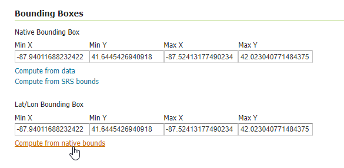
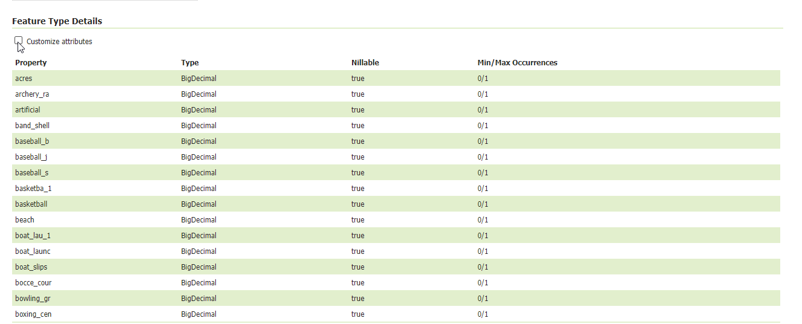

.. This is a comment. Note how any initial comments are moved by
   transforms to after the document title, subtitle, and docinfo.

.. demo.rst from: http://docutils.sourceforge.net/docs/user/rst/demo.txt

.. |EXAMPLE| image:: static/yi_jing_01_chien.jpg
   :width: 1em

**********************
Add Layer
**********************

.. contents:: Table of Contents

Add a Layer
===========================

**1.  On the left menu, click on Layers**

.. image:: Add-Layer-0.png

.. image:: spacer.png

**2.  Click the "Add new layer" link**

.. image:: layer-1.png

.. image:: spacer.png

**3.  In the New Layer dropdown, select 'postgis:postgis'**
   
.. image:: layer-2.png

.. image:: spacer.png

**4.  Upon selection, a list of layers availeble for publiscation will appear.  On the "neighborhoods" layer, click the "Publish" link**

.. image:: publish-layer.png

.. image:: spacer.png

**5.  Scroll down to the "Bounding Boxes" section.**

      For "Native Bounding Box", click "Compute from data" link.

      On the "Lat/Lon Bounding Box" section, click "Compute from native bounds"

.. image:: spacer.png

Accept all other defaults and click "Save"

.. note::
    Repeat above for the Parks layer and Waterways layers.

Preview Layer
===========================

We can now preview our layer.

**To do so, go to Layer Preview:**

.. image:: layer-4.png

.. image:: spacer.png

**Then click the "OpenLayers" link:**

.. image:: layer-5.png

.. image:: spacer.png

Customize Features
===========================

The features available for display can be customized.

To do so click the "Customize attributes" box

.. image:: spacer.png

With "Customize attributes" selected, we can edit Name, Type, Source, Description, Nillable, as well as Remove feature:

.. image:: layer-attributes-enabled.png

.. image:: spacer.png

  

