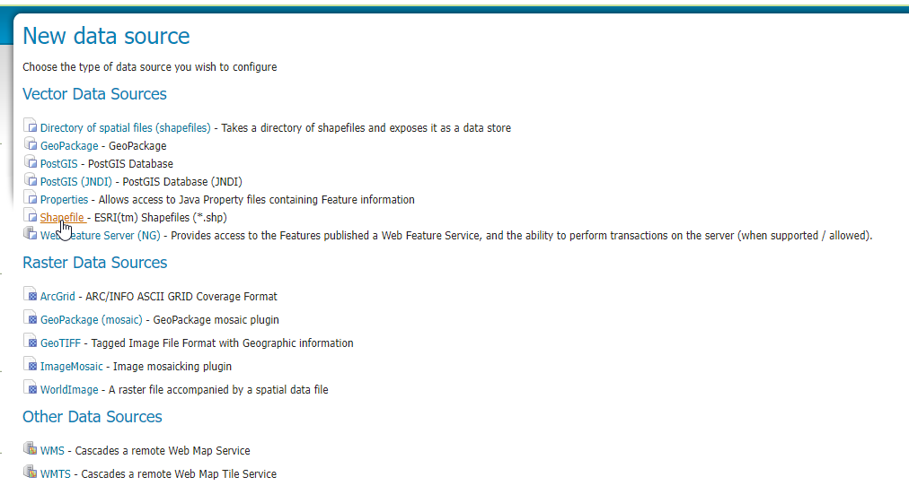
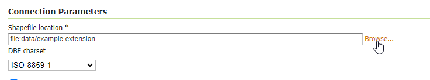
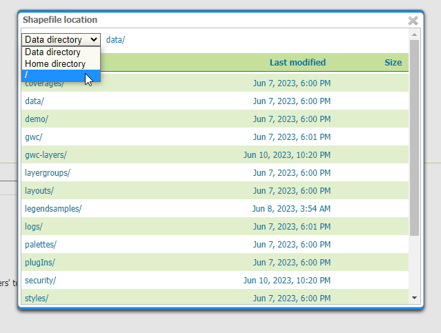
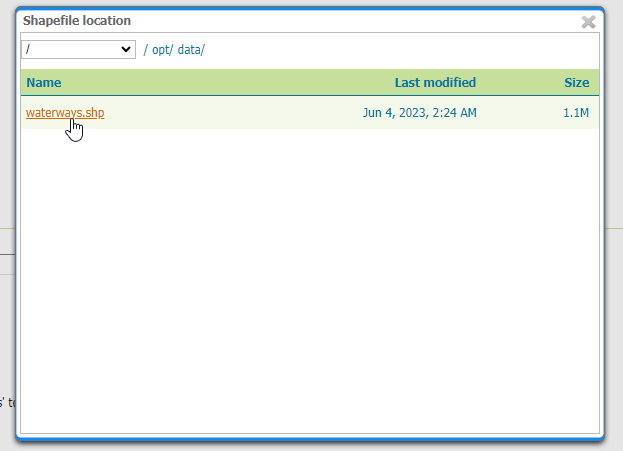

**********************
Load ESRI Shapefile
**********************

.. contents:: Table of Contents

Preparing the Shapefile
===================

When we loaded the shapefile into PostGIS earlier, we did so using shp2pgsql and the files remained zipped.

For creating a Store from a shapefile, we need to unzip the contents.

Connect via SSH and navigate to the //opt//data directory:

.. code-block:: console

   	root@demo:~# cd /opt/data

Listing the contents, we see the three .zip file containing our data

.. code-block:: console

	root@demo:/opt/data# ls	
	neighborhoods.zip  parks.zip  waterways.zip
	
Unzip the waterways.zip file using 'unzip -q waterways.zip'

.. code-block:: console

	root@demo:/opt/data# unzip -q waterways.zip
	
The contents are now unzipped:

.. code-block:: console

	root@demo:/opt/data# ls	
	neighborhoods.zip  waterways.dbf  waterways.shp  waterways.zip
	parks.zip          waterways.prj  waterways.shx
 
Create Shapefile Store
=====================

**1. Go to Stores > Add New Store and click the Shapefile link:**

**2. For Workspace, select 'postgis' and enter 'postgishp" for the name and description**

.. image:: da-shpfile.png

**3. In the Connection Parameters, click the browse link**

**4. For shapefile location, select // from the dropdown**

**5. Navigate to //opt//data and select the waterways.shp file**

**6. Click the Save button**

.. image:: da-shpfile-4.png

**7. On the New Layer screen, click the Publish link**

.. image:: da-shpfile-5.png

Enter the information as we did previously in Create Store

