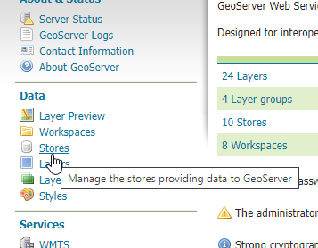
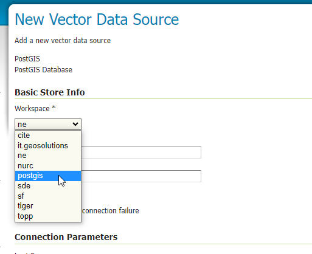
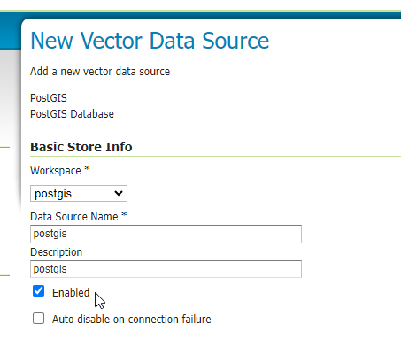
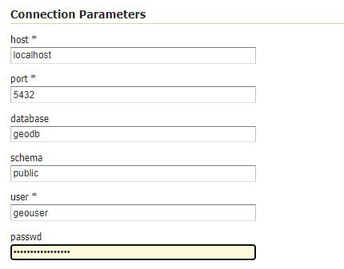
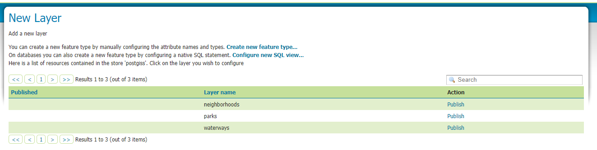

.. This is a comment. Note how any initial comments are moved by
   transforms to after the document title, subtitle, and docinfo.

.. demo.rst from: http://docutils.sourceforge.net/docs/user/rst/demo.txt

.. |EXAMPLE| image:: static/yi_jing_01_chien.jpg
   :width: 1em

**********************
Create Store
**********************

.. contents:: Table of Contents

Credentials
============

In order to create a PostGIS store, we'll need a PostgreSQL username and password.

We'll use the geodb database and geouser user we created ealier.

Add Store
=====================

**1.  On the left menu, click "Stores"**

.. image:: spacer.png  

**2.  Click the "Add new store" link**
   
.. image:: store-2.png

.. image:: spacer.png

**3.  Under the Vector Data Store section, click "PostGIS"**
      
.. image:: store-3.png

.. image:: spacer.png

**4.  In the Workspace dropdown, selection the postgis workspace we created earlier:**
	 

.. image:: spacer.png

**5. In the name and description fields, enter 'postgis'**

.. image:: spacer.png

**6.  In the Connection Parameters section, enter the information for the geodb database and geouser user:**

.. image:: spacer.png

**7.  Click the Save button.**

Note: clicking Save will direct you to the Layers available for the store.  You can publish the layers at this point, but we will do so in next section "Add a Layer"

.. image:: spacer.png

