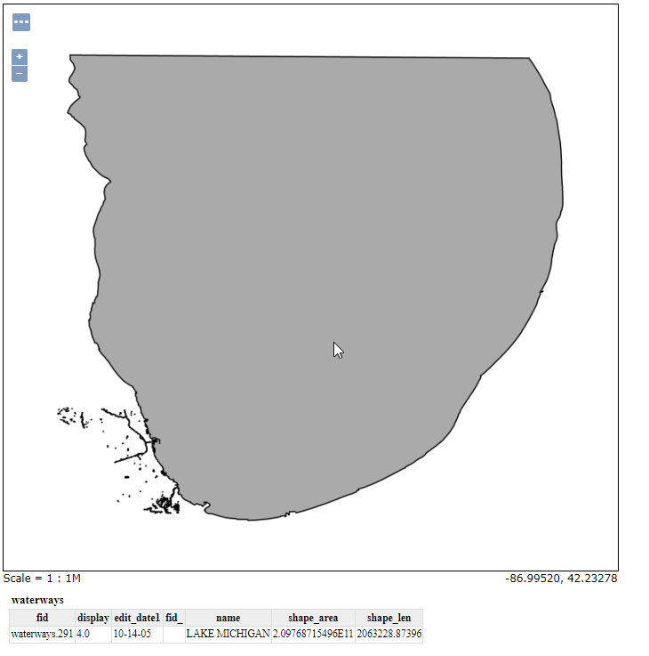
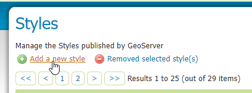
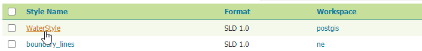
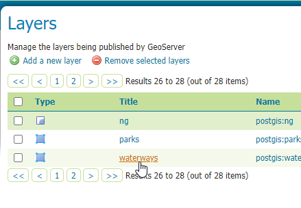
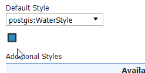

.. This is a comment. Note how any initial comments are moved by
   transforms to after the document title, subtitle, and docinfo.

.. demo.rst from: http://docutils.sourceforge.net/docs/user/rst/demo.txt

.. |EXAMPLE| image:: static/yi_jing_01_chien.jpg
   :width: 1em

**********************
Styles
**********************

.. contents:: Table of Contents

Default Styles
===============

For each type, GeoServer has default style that is used.

If we look at our Waterways layer, we see it is gray (the default polygon style).

We'd like to make this blue.

Create a Style
===============

**1. Click Styles on the left menu**

.. image:: new-style-start.png

**2. Click the "Add new style" link**

.. image:: spacer.png

**3. For name, enter 'WaterStyle'.  For Workspace, select postgis.**

.. image:: new-style-water.png

**4. In "Copy from existing style" dropdown, select green**

.. image:: new-style-green.png
.. image:: spacer.png

**5. Click the "copy" link to the right of the dropdown**

.. image:: new-style.png
.. image:: spacer.png

**6. As seen below, this loads the existing 'green' style into the style editor.  We will use this to create our WaterStyle blue.**

      
.. image:: new-style-2.png  

Copy an Existing Style
======================

Now that we have loaded the 'green' style to use as our template, we will update it to blue.  To do so, 

**1.  Update the required lines, as shown below:**

.. image:: new-style-3.png
.. image:: spacer.png

**2.  Click 'Validate' to check for errors.  If no errors, click the Save button.  Your new Style, "Waterways" should now appear in the Styles list.**

.. image:: spacer.png
.. image:: spacer.png

Apply Style
===========

**1.  Click the Layers button in the left menu**

.. image:: spacer.png

**2.  Select the waterways layer**

**3.  In the Publishing tab, select postgis:WaterStyle from the Default Style dropsown**

.. image:: new-style-6.png

.. image:: spacer.png

**4. On select, we should see the thumbnail reflect the blue color we chose above**

.. image:: spacer.png

**5. Click the Save button.**

If we now preview our layer in Layer Preview, our layer is now blue.

.. image:: select-syle-2.png

.. image:: spacer.png
.. image:: spacer.png

