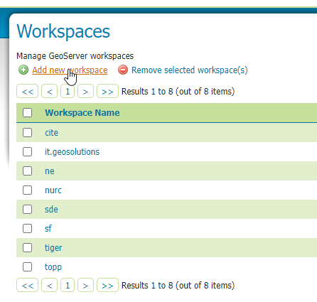
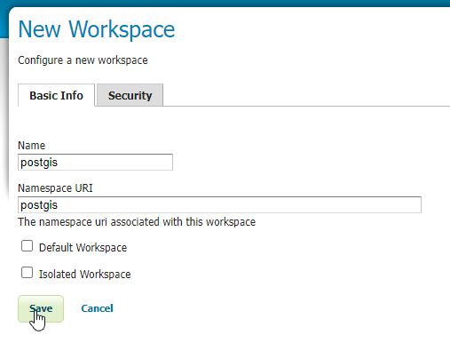
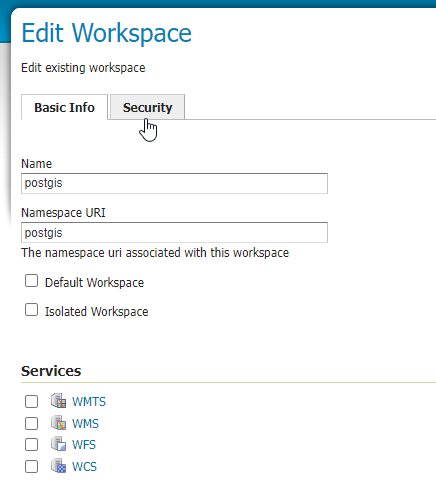

.. This is a comment. Note how any initial comments are moved by
   transforms to after the document title, subtitle, and docinfo.

.. demo.rst from: http://docutils.sourceforge.net/docs/user/rst/demo.txt

.. |EXAMPLE| image:: static/yi_jing_01_chien.jpg
   :width: 1em

**********************
Create a Workspace
**********************

**1. On the left menu, in the Data section, click on 'Workspaces'**

.. image:: workspace-1.png
.. image:: spacer.png

 
**2. Click the "Add New Workspace" link**

.. image:: spacer.png

**3. For both the name and namespace uri, enter 'postgis'**

.. image:: spacer.png

**4. Click the Security tab**

.. image:: spacer.png

**5. Check the "Grant access to any role" checkbox**

.. image:: workspace-5.png

.. image:: spacer.png

**6. Click the "Save" button.**

Congradulations - you've created a Workspace.

   

