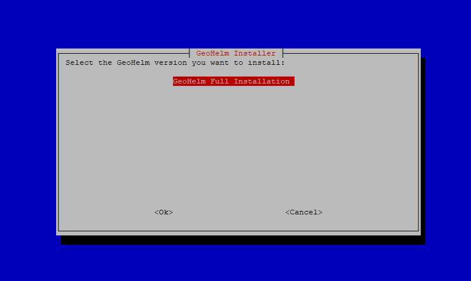
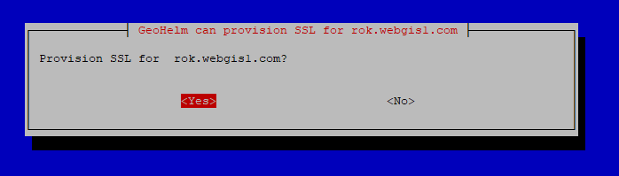
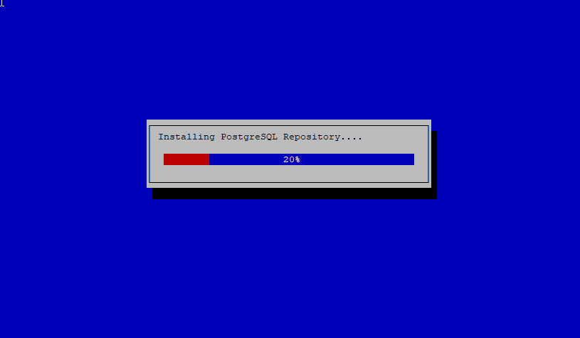

************
Installation
************

Installation is done via the GeoHelm Installer.

Check Hostname
------------------------

While you can use GeoHelm with only an IP address, if you wish to use SSL, be sure to set the hostname.

You can check using the 'hostname' command

.. code-block:: console
   
   root@suite:~# hostname
   suite

If the full hostname is not set, use hostnamectl to set the full hostname:

.. code-block:: console

   root@suite:~# hostnamectl set-hostname suite.domain.com

Use the hostname command to verify the full hostname is now set:

.. code-block:: console

   root@suite:~# hostname
   suite.domain.com

.. Note::  If using Rocky Linux, you may need to install wget before running the Installer.  You can do using 'yum -y install wget'

Run the Installer
------------------------

On a fresh Ubuntu 22 or Rocky Linux 9 installation, as root:

.. code-block:: console
   
   wget https://raw.githubusercontent.com/AcuGIS/geohelm/master/scripts/geohelm-installer.sh && chmod +x geohelm-installer.sh && ./geohelm-installer.sh
    
The above will start the installer

.. image:: _static/spacer.png

Tab to the OK button and hit enter

.. image:: _static/Install2.png

.. image:: _static/spacer.png

A reminder is displayed to set the hostname.  If you have set the hostname, or do not wish to use SSL, hit continue

.. image:: _static/Install3.png

.. image:: _static/spacer.png

A prompt will ask you if you would like GeoHelm to provision a free SSL certificate using LetsEncrypt

.. image:: _static/spacer.png

The installation progressed is displayed as below.

.. image:: _static/spacer.png

A full installation on Ubuntu takes about 3 to 4 minutes to complete installation.

A full installation with Rocky Linux can take 10-15 minutes due to manual OSM build required.

Upon completion the display will show as below:

.. code-block:: console

        Installation is now completed.
        Access pg-tileserv at http://YourIP:7800
        Access pg-featureserv at http://YourIP:9000
        postgres and crunchy pg passwords are saved in /root/auth.txt file
        

The passwords are also stored in the file /root/auth.txt following set up

Enable SSL
------------------------

If you did not have the GeoHelm installer enable SSL, you can use the script below to issue a certificate and configure Apache, the control panel, and pg_tileserv for SSL.

.. code-block:: console

   wget https://raw.githubusercontent.com/AcuGIS/geohelm/master/scripts/build-ssl.sh && chmod +x build-ssl.sh && ./build-ssl

After a few moments you should see the success message below:

.. code-block:: console

   Successfully received certificate.
   Certificate is saved at: /etc/letsencrypt/live/suite.domain.com/fullchain.pem
   Key is saved at:         /etc/letsencrypt/live/suite.domain.com/privkey.pem
   This certificate expires on 2023-09-19.
   These files will be updated when the certificate renews.
   Certbot has set up a scheduled task to automatically renew this certificate in the background.

   Deploying certificate
   Successfully deployed certificate for suite.webgis1.com to /etc/apache2/sites-available/000-default-le-ssl.conf
   Congratulations! You have successfully enabled HTTPS on https://suite.domain.com

   - - - - - - - - - - - - - - - - - - - - - - - - - - - - - - - - - - - - - - - -
   If you like Certbot, please consider supporting our work by:
    * Donating to ISRG / Let's Encrypt:   https://letsencrypt.org/donate
    * Donating to EFF:                    https://eff.org/donate-le
   - - - - - - - - - - - - - - - - - - - - - - - - - - - - - - - - - - - - - - - -

SSL is now enabled for Apache, control panel, pg_tileserv, and pg_featursrv

Troubleshooting
------------------------

GeoHelm creates a log file for each installation process.

The files are located in the /tmp directory (screenshot below).

If installation fails, check the last log file generated to see the cause of the failure.

.. image:: _static/install-log.png

.. image:: _static/spacer.png

Removing the Control Panel
-------------------------

If you do not wish to use the control panel for any reason, it can be removed using below.

Removing the control panel has no effect on any of the components (PostGIS, GeoServer, etc...)

.. code-block:: console
   
   root@suite:~# ./etc/webmin/uninstall.sh
  

