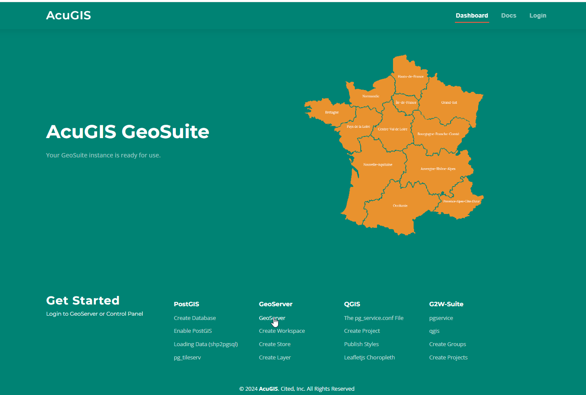

**********************
Intro
**********************

.. contents:: Table of Contents

Overview
------------

.. image:: _static/spacer.png

AcuGIS GeoSuite is used to install, configure, and manage the latest stable releases of 

`Apache Tomcat`_

.. _`Apache Tomcat`: https://tomcat.apache.org/

`GeoServer`_

.. _`GeoServer`: https://geoserver.org/ 

`PostgreSQL`_

.. _`PostgreSQL`: https://www.postgresql.org/

`PostGIS`_

.. _`PostGIS`: https://postgis.net 

`PgRouting`_

.. _`PgRouting`: https://pgrouting.org// 

`osm2pgsql`_

.. _`osm2pgsql`: https://github.com/openstreetmap/osm2pgsql/blob/master/docs/usage.md/

`shp2pgsql`_

.. _`shp2pgsql`: https://postgis.net/docs/using_postgis_dbmanagement.html#shp2pgsql_usage

`raster2pgsql`_

.. _`raster2pgsql`: http://postgis.refractions.net/docs/using_raster.xml.html/

`pg_tileserv`_

.. _`pg_tileserv`: https://github.com/CrunchyData/pg_tileserv

`pg_featureserv`_

.. _`pg_featureserv`: https://github.com/CrunchyData/pg_featureserv

`MapStore2`_

.. _`MapStore2`: https://docs.mapstore.geosolutionsgroup.com/en/latest/

Supported Operating Systems
---------------------------
* Ubuntu 22 LTS
* Rocky Linux 9.x

Resource Requirements
-------------------------------
* 10 GB SSD
* RAM: 4 GB RAM (Minimim)

OpenGeoSuite
-----------------

AcuGIS GeoSuite is based on similar concepts to OpenGeo Suite, but with key differences to reflect changes in GIS technology.

1. The growth of mapping frameworks, applications and libraries have increased the options available for building webgis applications.

2. Both documentation and community support for webgis frameworks and libraries have improved exponentialy

3. Rather than using a repository, GeoSuite uses an installer to install the latest, stable versions of each component.

4. Documentation is limited to usage and getting started with components, rather than replicating the full documentation.

Authors
-------
* `AcuGIS`_
* `David Ghedini`_
* `Kaloyan Petrov`_

.. _`AcuGIS`: https://www,acugis.com
.. _`Kaloyan Petrov`: https://github.com/kaloyan13
.. _`David Ghedini`: https://github.com/DavidGhedini

Open Source
-----------

Free, Open Source Software.

GNU GENERAL PUBLIC LICENSE v3

    

