**********************
Create a Dashboard
**********************

.. contents:: Table of Contents

Create New Dashboard
===================

**Click the Create Dashboard button on the home page**

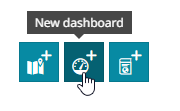

.. image:: _static/spacer.png

Add Map Widget
===================

.. image:: _static/spacer.png 
**1. Click the Add Map button in the left menu**

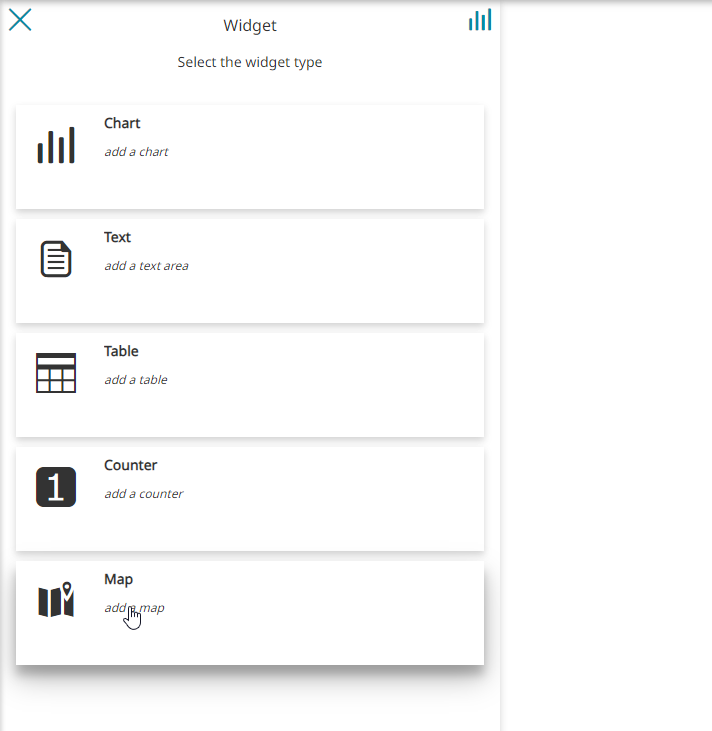

.. image:: _static/spacer.png

**2. Select Empty Map**

.. image:: _static-dashboard/1-add-empty-map-2.png

.. image:: _static/spacer.png

**3. Give your map a name and click the check button**

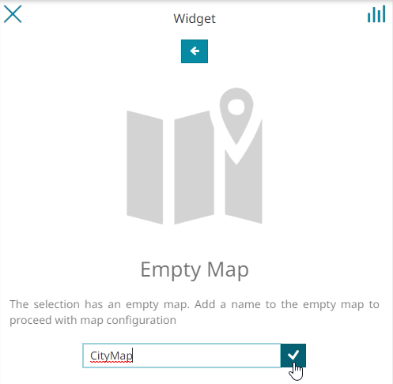
.. image:: _static/spacer.png

**4. No layers are detected, so click the "Add a layer to the map" button**

.. image:: _static-dashboard/3-add-layer.png

.. image:: _static/spacer.png

**5. On the Select a Layer screen, click the + button to add a WMS source**

.. image:: _static-dashboard/4-3-add-layer.png

.. image:: _static/spacer.png

**6. Give your WMS source a name, enter the url, and click Save**

.. image:: _static-dashboard/5-3-add-layer.png

.. image:: _static/spacer.png

**7. In the search box of the layer list enter 'postgis' to easily filter the postgis layers we created earlier**

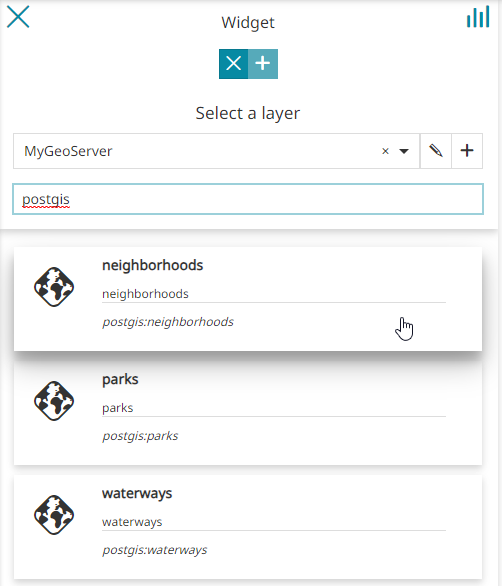

.. image:: _static/spacer.png

**8. Select the neighborhood layer and click the "Use the selected layer" button**

.. image:: _static-dashboard/73-add-layer.png
.. image:: _static/spacer.png

**9. In the layer preview, pan the layer so it is visible**

.. image:: _static-dashboard/83-add-layer.png

.. image:: _static/spacer.png

**10. Repeat steps 4-9 above to add both the parks and waterways layers**

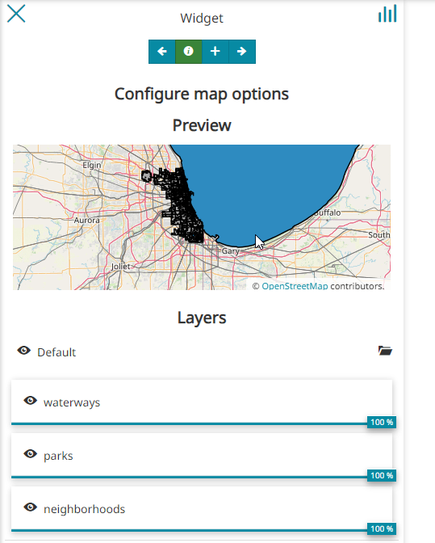
.. image:: _static/spacer.png

**11. Click the 'Configure widget options' arrow**

.. image:: _static-dashboard/103-add-layer.png

.. image:: _static/spacer.png

**12.  Enter a name for the map and click the Save icon to add the widget**

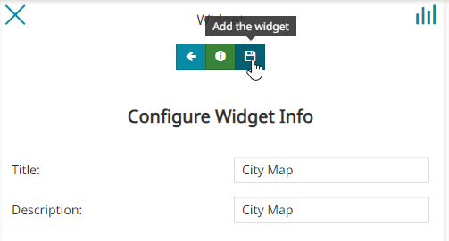
.. image:: _static/spacer.png

**13. The map widget is now added to the Dashboard**

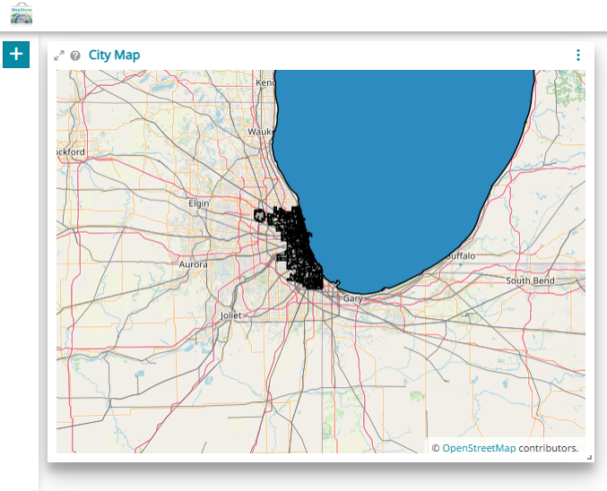
.. image:: _static/spacer.png

Save and Style Test
------------------------

Earlier, we created a style for our waterways layer to make it blue.

When we expand our map widget, however, we see that both the neighborhoods and parks layers are using the default polygon gray color.  This makes the layers visually indistinguishable.  So, let's change the parks color to green.

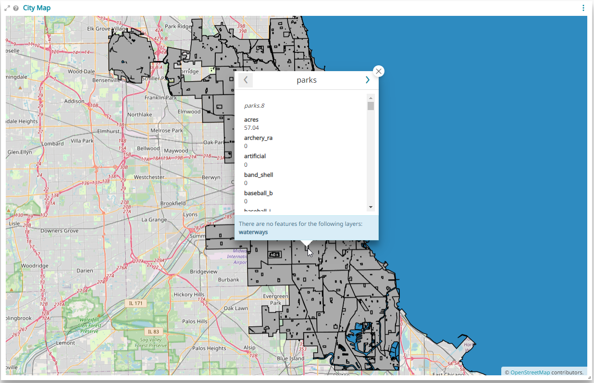

.. image:: _static/spacer.png

Before changing the parks layer style, let's save our work by clicking the Save icon and entering our Dashboard name and description.

.. image:: _static-dashboard/13-save-it.png

**1. Log into GeoServer and click on Layers and click the parks layer**

.. image:: _static-dashboard/14.png

**2. For default style, select 'green' and click Save**

.. image:: _static-dashboard/15.png

**3. Returning to dashboard and refreshing, the park layer is now green**

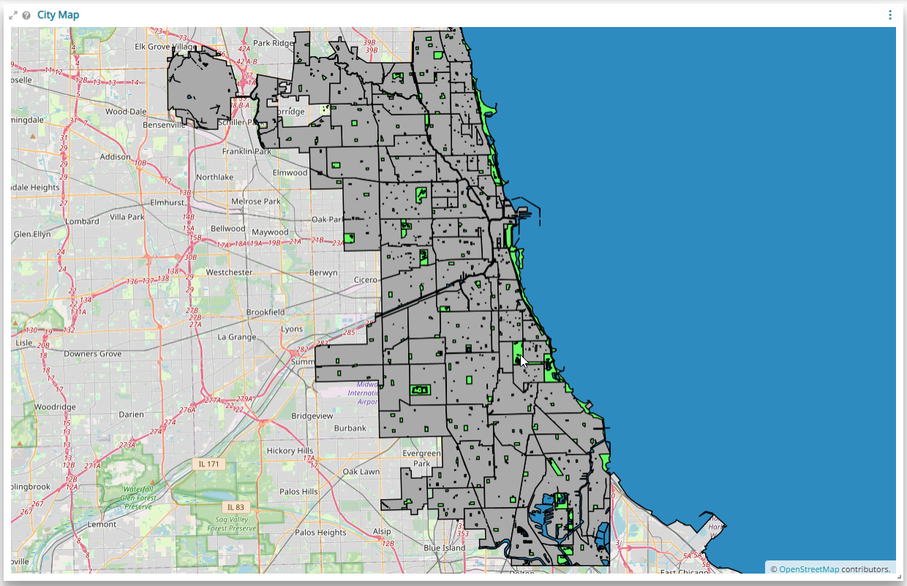

Add Table Widget
===================

.. image:: _static/spacer.png
**1. On the widget menu and click "Add Table"**

.. image:: _static/table-0.png

.. image:: _static/spacer.png

**2. Select the neighborhoods layer and then click 'Use the selected layer' arrow**

.. image:: _static-dashboard/select-neighborhood-layer.png

.. image:: _static/spacer.png

**2. De-select all fields except pri_neigh and sec_neigh.  Click the plug icon to "Connect to the map".  Connecting the table widget to the map will make changes in the map reflect in the table**

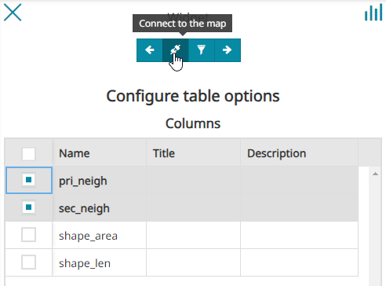

.. image:: _static/spacer.png 

**3. Give the fields readable names**

.. image:: _static-dashboard/19-add-table.png

.. image:: _static/spacer.png 

**4. Enter a name and description and click the save icon**

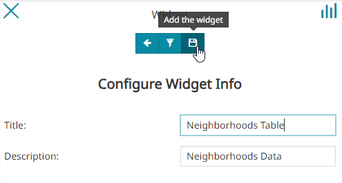

**5. The table widget has now been added to the dashboard**

.. image:: _static-dashboard/20-add-table.png

Add Legend Widget
===================

.. image:: _static/spacer.png
**1. On the widget menu and click "Add Legend"**

.. image:: _static/table-8.png

.. image:: _static/spacer.png 

**2. Click the Configure Widget arrow and add a name and description.  Click the save icon to add widget:**

.. image:: _static-dashboard/25-add-legend.png

.. image:: _static/spacer.png 

**3. The Legend widget has now been added:**

.. image:: _static-dashboard/25-add-legend-2.png

.. image:: _static/spacer.png 

Add Text Header
====================
 
.. image:: _static/spacer.png

**1. On the widget menu and click "Add Text"**

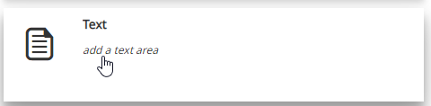

.. image:: _static/spacer.png 

**2. Enter and format the text as you wish to, then click the Save icon**

.. image:: _static-dashboard/25-text1.png

.. image:: _static/spacer.png 

**The text widget has now been added to the dashboard**

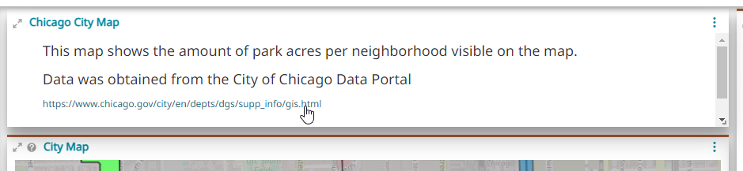

.. image:: _static/spacer.png 

.. image:: _static/spacer.png 

Add Chart Widget
===================

.. image:: _static/spacer.png

**1. Click Add Chart:**

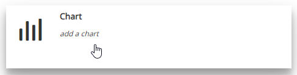
.. image:: _static/spacer.png 

**2. Select and add the parks layer**

**3. For X Attribute, select park and for Y Attribute select acres.  Make the chart bar color green to match the layer.  Be sure to also click the plug icon to "Connect to the map"**

.. image:: _static-dashboard/21-add-chat.png
.. image:: _static/spacer.png 

**4. Click the configure widget arrow**

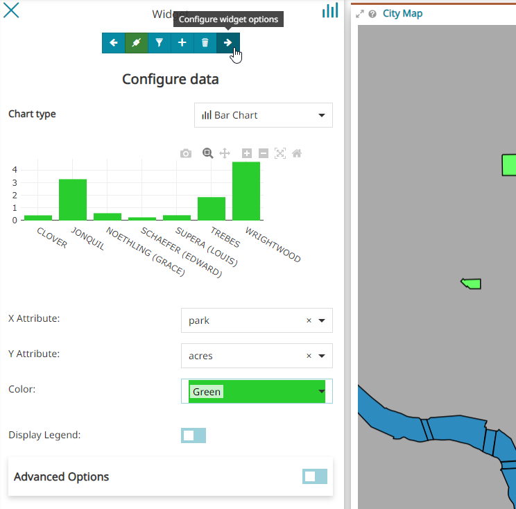
.. image:: _static/spacer.png 

**5. Enter a name and descirption for the chart and click the save icon**

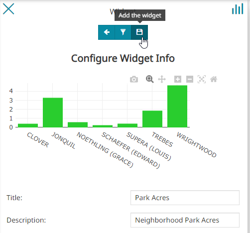
.. image:: _static/spacer.png 

**The chart widget has now been added to the dashboard**

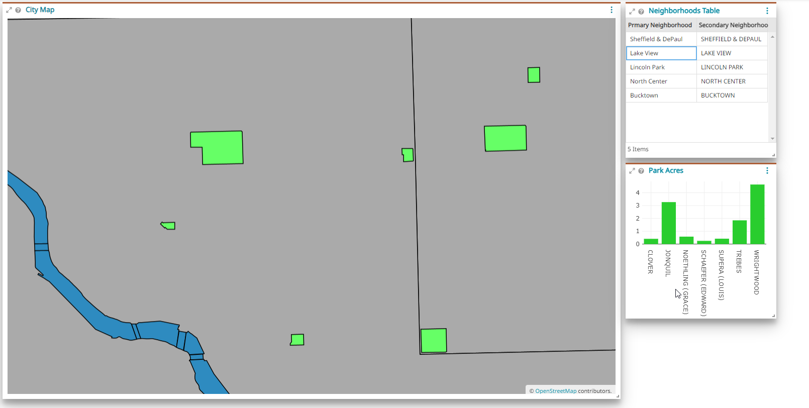
.. image:: _static/spacer.png 

Arrange Your Dashboard
======================

.. image:: _static/spacer.png 

Once your Widgets have been added drag the Widgets to arrange them on the dashboard:

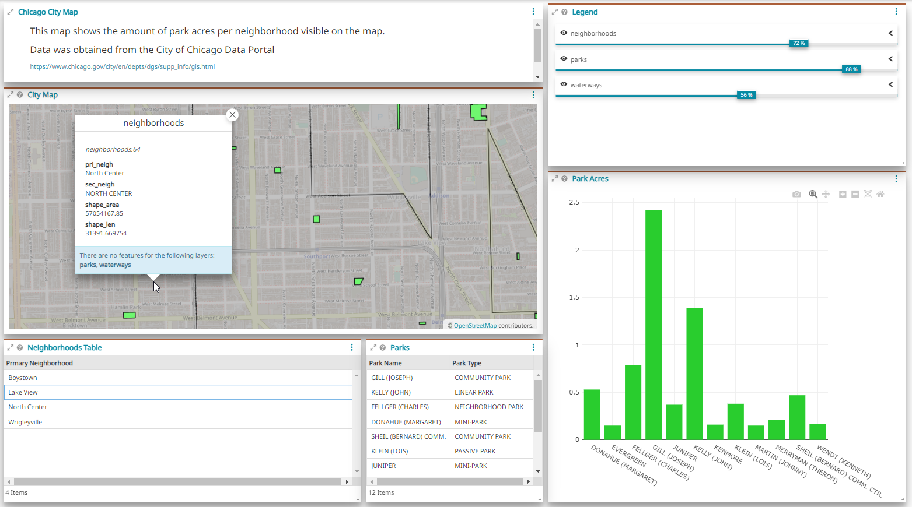

