.. This is a comment. Note how any initial comments are moved by
   transforms to after the document title, subtitle, and docinfo.

.. demo.rst from: http://docutils.sourceforge.net/docs/user/rst/demo.txt

**********************
MapStore2
**********************

.. contents:: Table of Contents

Access
==================

MapStore2 can be accessed via:

	https://domain.com/mapstore

Admin Area
============

To access as MapStore2 Admin, navigate to:

	https://domain.com/mapstore

Click on the Login drop-down at top right.

.. image:: _static/mapstore-1.png

\

.. Note:: 
   The default user/pass is admin/admin  Be sure to change the password!  

Create a Map
============
\
To create a map in Mapstore2:
\ 
* Click the "New Map" icon as shown below.

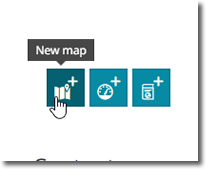

\ 
\ 
* Click the "Layers" icon as shown below.

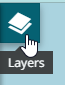
 
\ 
\ 
* Click the "Add Layers" icon as shown below.

 
.. image:: _static/mapstore-4.png

\ 
\ 
* On the right side Catalog menu, click the "+" button to add your GeoServer WMS url

.. image:: _static/mapstore-6.png

\ 
\ 
* Enter your GeoServer URL and clck Save:

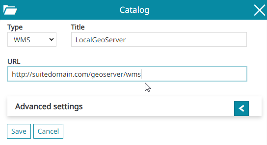

\  
* You should see a message at center confirming it's been saved.  

.. image:: _static/mapstore-8.png 
    
\ 
\ 
* Now, select the WMS service you just entered from the dropdown:  

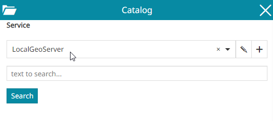

\ 
* In the Search field, enter "Population" to locate the US Population layer from GeoServer  

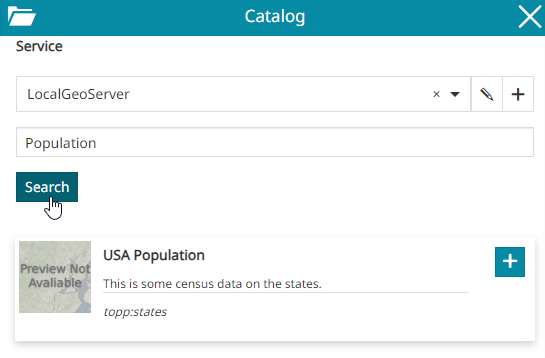

\ 
\ 
* Click the "Add to Map" button to add the layer to your map:  

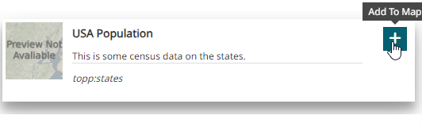

\ 
* Your layer should now appear on the map as below:

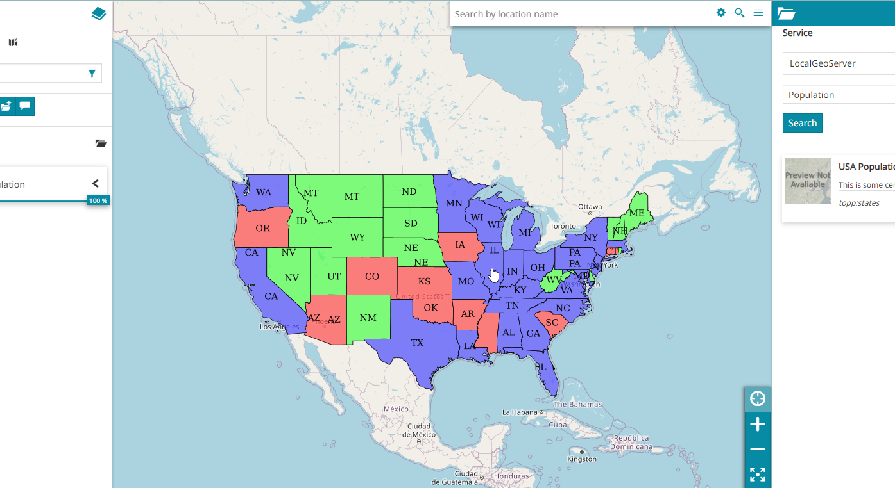

\ 
\ 
* On the right side menu, click the "Save As" icon

.. image:: _static/mapstore-13.png

\ 
\ 
* Enter a name and description and, optionally, a thumbnail.

.. image:: _static/mapstore-14.png

\ 
* Set any permissions you wish to.  Here, we are giving access to the Public

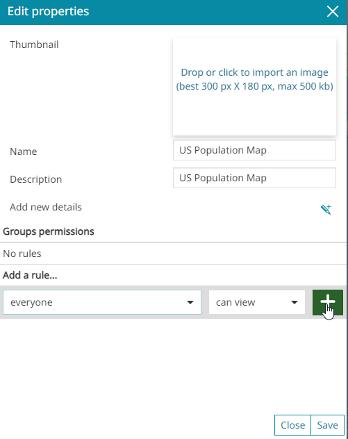

\ 
Congradulations!  You've created your first Mapstore2 map using your GeoServer instance.

.. image:: _static/mapstore-16.png

\ 

Create a Dashboard
===================

\ 
Click the Create Dashboard button on the home page.

.. image:: _static/new-dashboard.png

\ 

Add Map Widget
===================

\ 
Click the Add Map button in the left menu

.. image:: _static/mapstore-a.png

\ 
\ 
Select the US Population map

.. image:: _static/mapstore-b.png

\ 
\ 
Click the right arrow "Use this map"

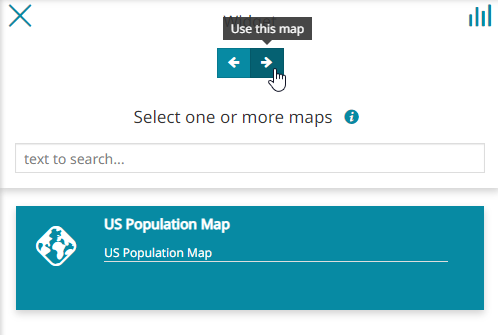

\
\ 
Click the right arrow "Configure Widget Options"

.. image:: _static/widget-options.png

\ 
\ 
Enter a name and description for the widget and the click the Save icon to add the widget

.. image:: _static/widget-options-2.png

\ 
\ 
You've now added the map widget.

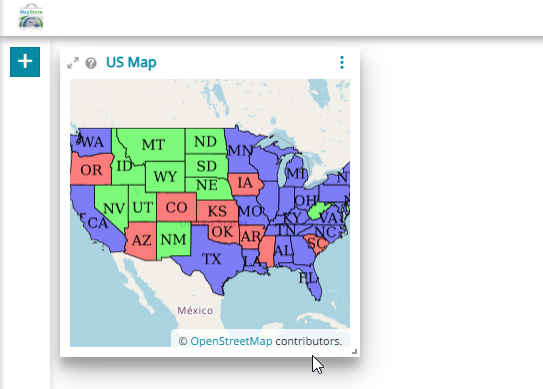

Add Table Widget
===================

\ 
\ 
On the widget menu and click "Add Table"

.. image:: _static/table-0.png

\ 
\ 
Select the US Population layer

.. image:: _static/table-1.png

\ 
\ 
Select the fields you want to include:

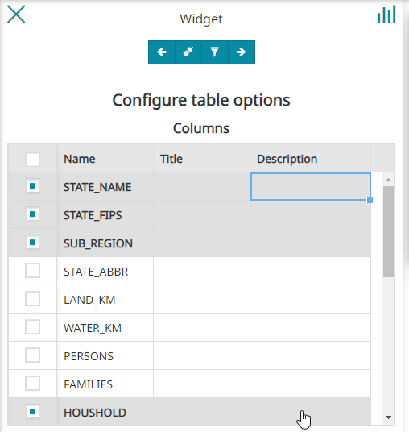

\ 
\ 
In order to make the Dashboard elements interactive, click "Connect to the map"

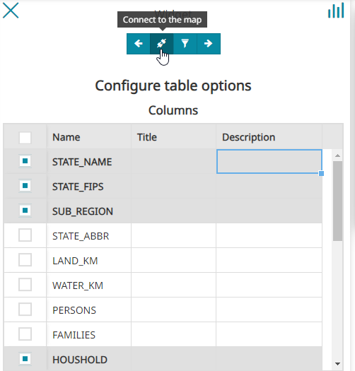

\ 
\ 
Click the right arrow and add name and description:

.. image:: _static/table-4.png

\ 
\ 
Click the Save icon to add the Table widget to the dashboard:

.. image:: _static/table-5.png

\ 
\ 
The Table widget has now been added:

.. image:: _static/table-7.png

\ 
\ 

Add Legend Widget
===================

\ 
On the widget menu and click "Add Legend"

.. image:: _static/table-8.png

\ 
\ 
Click the Configure Widget arrow:

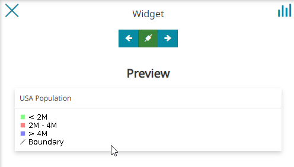

\ 
\ 
Enter a name and description and click "Add Widget"

.. image:: _static/table-10.png

\ 
\ 
The Legend widget has now been added:

.. image:: _static/table-11.png

\ 
\ 

Add Chart Widget
===================

\ 
\ 
Click Add Chart:

.. image:: _static/add-chart.png

\ 
\ 
Add and select the US Population layer

.. image:: _static/add-chart-2.png

\ 
\ 
Select the Line Chart and select the axis values, then click "Configure Widget Options" arrow

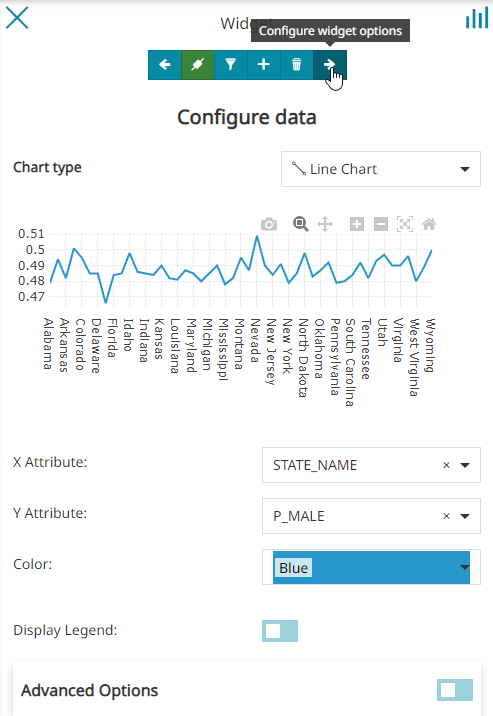

\ 
\ 
Add a title and description

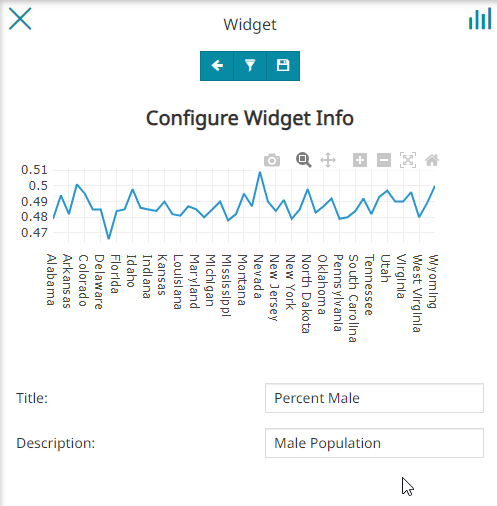

\ 
\ 
Click "Add Widget.  Your chart is added to the Dashboard:

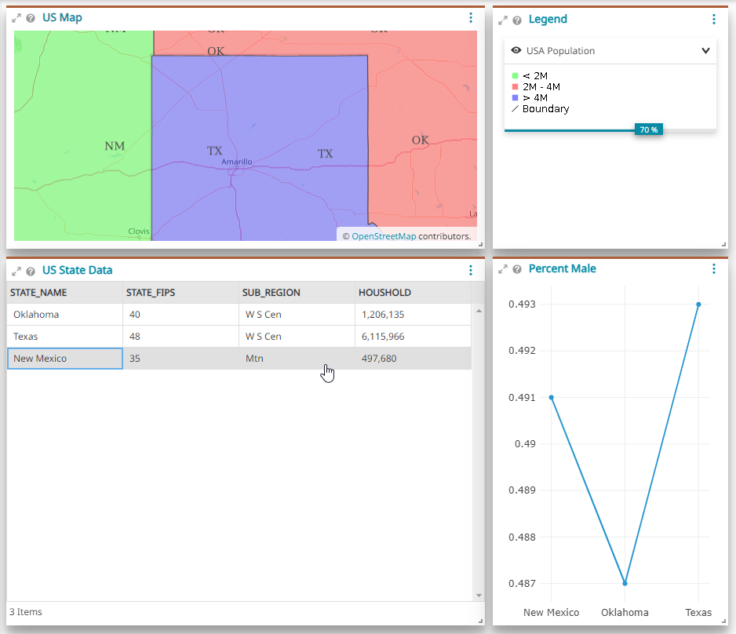

\ 
\ 

Arrange Your Dashboard
======================

\ 
\ 
Once your Widgets have been added drag the Widgets to arrange them on the dashboard:

.. image:: _static/final-dashboard.png

