**********************
Users and Groups
**********************

.. contents:: Table of Contents

Manage Accounts
----------------
When logged in as admin, select Manage Accounts from the dropdown at top right settings icon

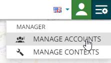

.. image:: _static/spacer.png

The accounts dashboard is displayed

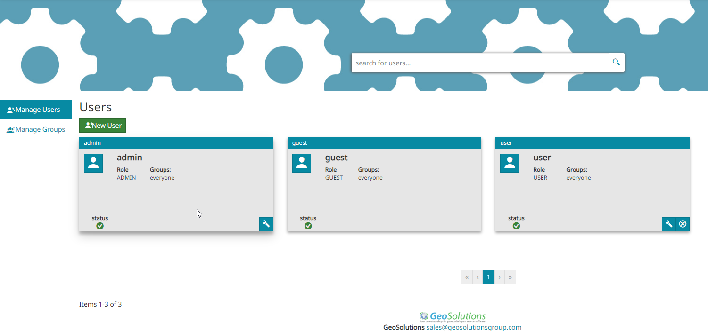

.. image:: _static/spacer.png

Create User
----------------

**1. Click the New User button**

.. image:: _static-users/mapstore-add-user.png

.. image:: _static/spacer.png

**2. Enter the username and password.  From the dropdown, select if new user will have User or Admin role.**

.. image:: _static-users/mapstore-add-user-2.png

.. image:: _static/spacer.png

**3. Click the Attributes tab.  Add the user to any groups you wish to.**

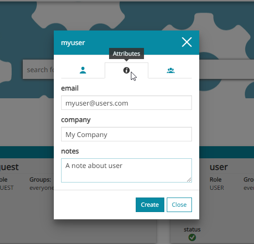

.. image:: _static/spacer.png

**4. Click the Create button**

.. image:: _static-users/mapstore-add-user-4.png

.. image:: _static/spacer.png

**The user is now created**

Create Group
-------------------

**1. On the Manage Users tab, click the New Group button**

.. image:: _static-users/mapstore-groups.png

**2. Give your Group a name and description**

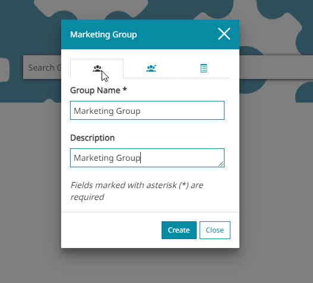

**3. On the users tab, add any users you wish to add**

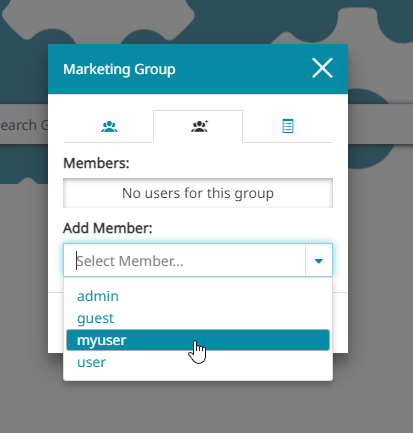

**4. On the users tab, add any users you wish to add**

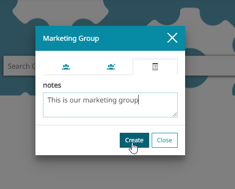

**4. On the notes tab, add any notes you wish to add**

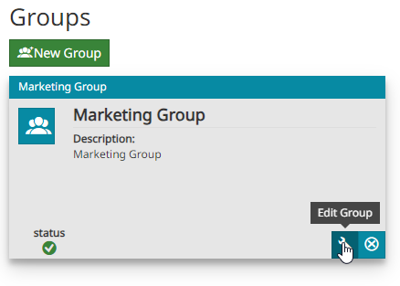

Set Permissions
-----------------------

**1. On the main page, click the Edit icon on the dashboard you created**

.. image:: _static-users/permissions-1.png

**2. Under 'Add a Rule...' select the Marketing Group we created above**

.. image:: _static-users/permissions-2.png

**3. Use the dropdown to select if Group members can View or Edit**

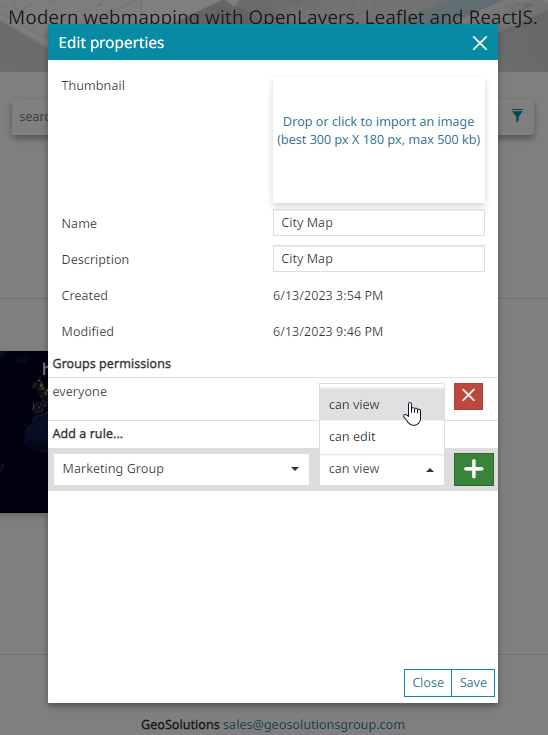

**4. Click the + button to add the rule**

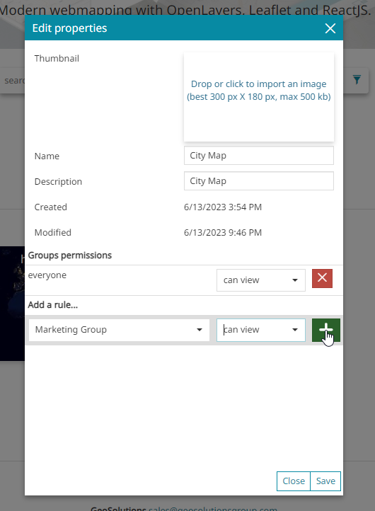

**5. Now, click the - minus button to remove the 'everyone' group**

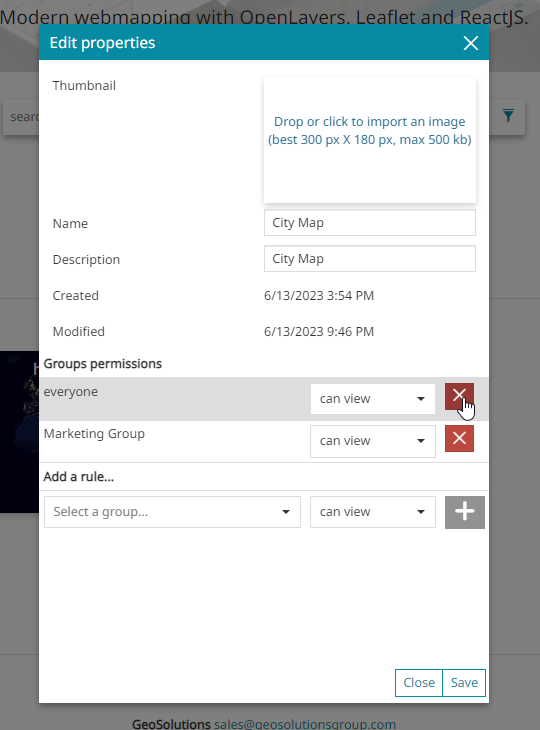

**6. Click Save**

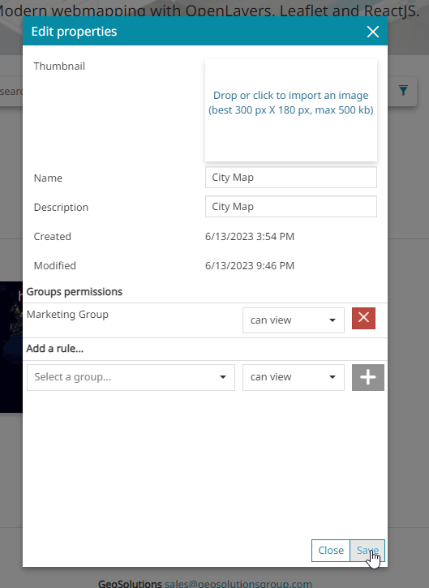

You have now created a user and a group and set permissions for your Dashboard
 

