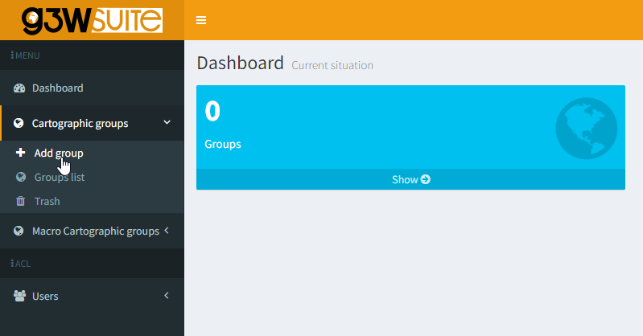
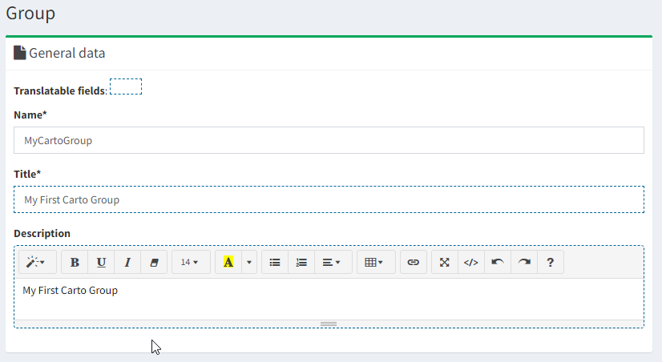
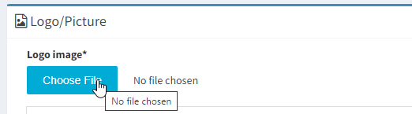
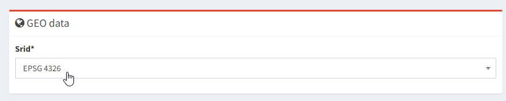
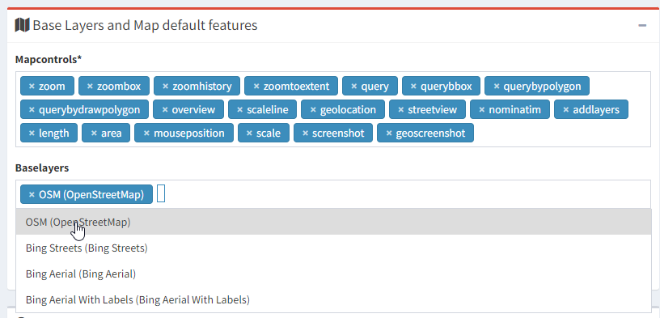
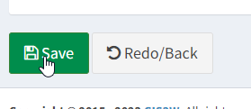
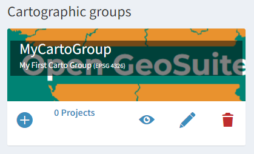
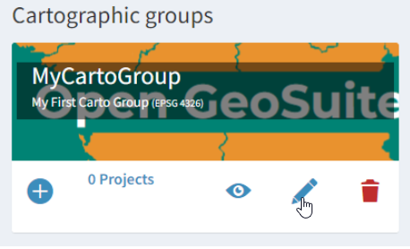

**********************
Groups
**********************

.. contents:: Table of Contents

Create a Group
===================

**1. On the left menu, click the Add Group button**

.. image:: _static/spacer.png

**2. Give your Group a name, title, and description**

.. image:: _static/spacer.png

**3. Upload a Group image png**

.. image:: _static/spacer.png

**4. Select a SRID for the group.  Select 4326 if you are following demos using GeoSuite**

.. image:: _static/spacer.png

**5. For baselayer, select OpenStreetMap**

.. image:: _static/spacer.png

**6. Click the Save button at bottom left of page**

.. image:: _static/spacer.png

**7. Our new Group now appears in the Dashboard**

.. image:: _static/spacer.png

Congradulations, you have created your first Cartographic Group

Edit a Group
===================

To edit a group, click the edit icon as shown below

.. image:: _static/spacer.png

Delete a Group
===================

To delete a group, click the delete icon as shown below

.. image:: _static/spacer.png

