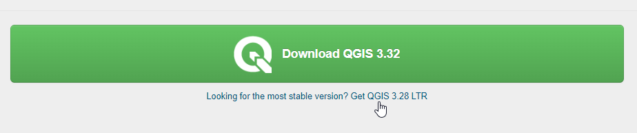

.. This is a comment. Note how any initial comments are moved by
   transforms to after the document title, subtitle, and docinfo.

.. demo.rst from: http://docutils.sourceforge.net/docs/user/rst/demo.txt

.. |EXAMPLE| image:: static/yi_jing_01_chien.jpg
   :width: 1em

**********************
Introduction
**********************

.. contents:: Table of Contents

About 
==================

QGIS is a desktop application for that allows you to create, edit, visualise, and geospatial data.

https://www.qgis.org

Documentation is extensive and well organized.

Here, we will simply cover creating, styling, and publishing a QGIS project to GeoServer.

Install QGIS
============

If you have not already done so, download the latesr version of QGIS from below:

https://www.qgis.org/en/site/forusers/download.html

Unless you have specific reasons otherwise, we recommend installing the "most stable" release

This will download the installer for your operating system and you can follow the installer instructions.
