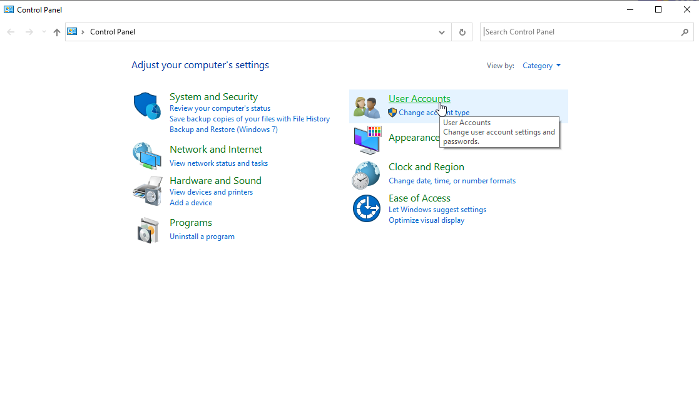
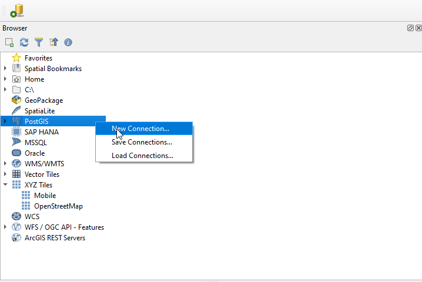
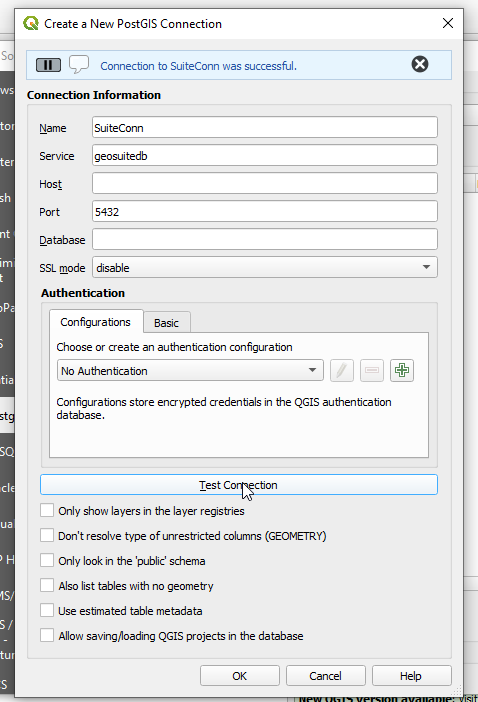

.. This is a comment. Note how any initial comments are moved by
   transforms to after the document title, subtitle, and docinfo.

.. demo.rst from: http://docutils.sourceforge.net/docs/user/rst/demo.txt

.. |EXAMPLE| image:: static/yi_jing_01_chien.jpg
   :width: 1em

**********************
pg_service.conf
**********************

.. contents:: Table of Contents

Why Use It?
=====================

The pg_service.conf file allows you to connect your QGIS project using only a Service Name, so your password is not stored (even in in encrypted format) in your QGIS document.

This is particulary important with QGIS as a misconfigured qgis_mapserver or Apache/NGINX can cause the .qgis file to be downloaded rather than rendered in the browser.

Create File on Server
=====================

**1. Create the pg_service.conf file under the /etc/postgresql-common directory**

.. image:: _static/40-pg_service-1.png

.. image:: _static/spacer.png

**2. The contents of the file should be as below.  Make sure to substitute your geouser password for the password show below**

.. image:: _static/40-pg_service-2.png

.. image:: _static/spacer.png

Test File on Server
===================

It's a good idea to test your file. 

To do, su to user postgres::

	root@suite:~# su - postgres

Issue psql service=geosuiteb::

	postgres@suite:~$ psql service=geosuitedb
	psql (15.3 (Ubuntu 15.3-1.pgdg22.04+1))
	SSL connection (protocol: TLSv1.3, cipher: TLS_AES_256_GCM_SHA384, compression: off)
	Type "help" for help.
	geodb=>
	
You have now verified the pg_service.conf file is working correctly.

Create File on Desktop
=====================

**1. Copy the pg_service.conf file you created above to your desktop and note the location**

**2.  Change the host to the hostname (or IP) of your GeoSuite server**

So, for example, if your GeoSuite is running on IP 1.2.3.4, your file would look as below::

	[geosuitedb]
	host=1.2.3.4
	port=5432
	dbname=geodb
	user=geouser
	password=Tristan1902

Register File
============

To registet the file, on Windows:

**1.  Go to Control Panel and click on User Acccounts**

.. image:: _static/spacer.png

**2.  Click the User Acccounts link**

.. image:: _static/control-panel-2.png

.. image:: _static/spacer.png

**3. On the left menu, click "Change my environmental variables"**

.. image:: _static/control-panel-3.png

.. image:: _static/spacer.png

**4. In the Environmental Variables box click new.  In the New User Variable box enter PGSERVICEFILE for Variable name and the location you saved the pg_service.conf file above as Variable value.  Click OK** 

.. image:: _static/control-panel-4.png

.. image:: _static/spacer.png

You have now registered your pg_service.conf file.
   
Test File on Desktop
======================

To test our pg_service.conf file on our desktop, start QGIS.

**1. On the left menu, click PostGIS and then right click "Add New Connection"**

.. image:: _static/spacer.png

**2. In the Create New PostGIS Connection box, give your connection and name enter your service name**

.. image:: _static/30-qgis-0-2.png

.. image:: _static/spacer.png

**3. Click the Test Connection button.  You should see a success message at top as show below**

.. image:: _static/spacer.png

Congradualtions, you have successfully create a pg_service.conf file on your server and desktop

 

