**********************
QGIS Plugins
**********************

.. contents:: Table of Contents

Add Plugins
======================

QGIS Plugin Manager allows you to install plugins directly from the QGIS Plugin Manager.

.. image:: _static/plugins-1.png

QuickMapServices
=================================

Let's start by adding one of the most popular plugins, QuickMapServices.

QuickMapServices allows you to easily add basemaps to your project

Go to Plugin > Plugin Manager and make sure "All" is selected at left.

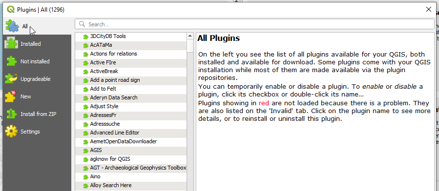

Enter QuickMapService in the search field

.. image:: _static/plugins-3.png

Click the Install button

With QuickMapServices installed, create a new Project.

On the top menu, click QuickMapService > OSM > OSM Standard

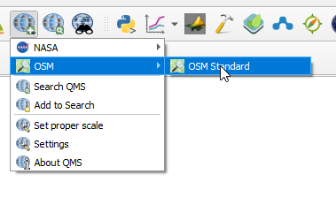

This will add an OSM basemap to your project as shown below:

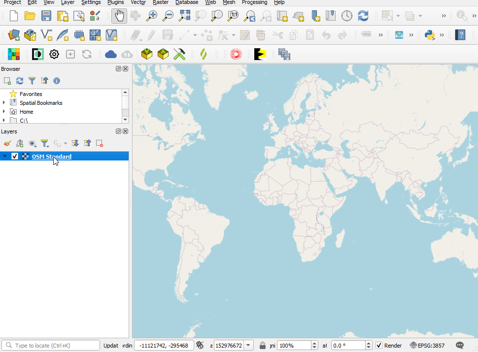

Next, add a layer to your project:

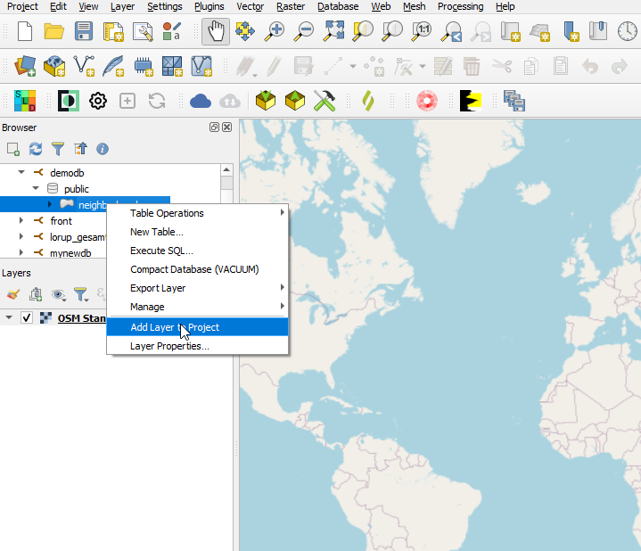

You've now added a basemap and layer

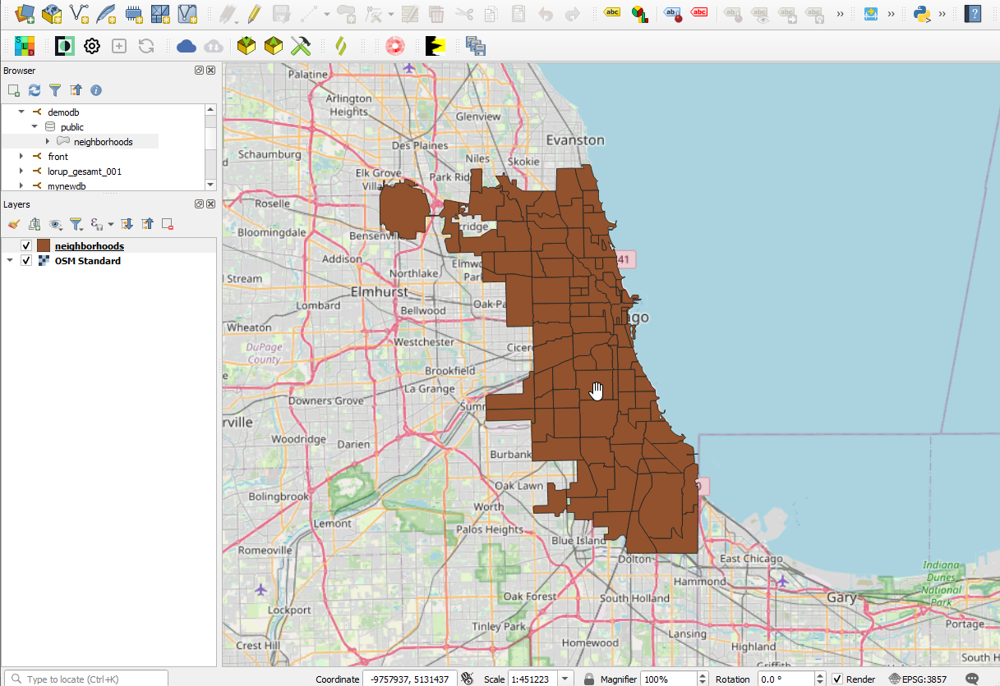

qgis2web
==============================

qgis2web is another popular plugin and we'll be using it for QuartzMap.

Go to Plugin > Plugin Manager and make sure "All" is selected at left.

Enter qgis2web in the search field

.. image:: _static/plugins-5.png

Click the Install button

With the qgis2web Plugin installed, go to qgis2web

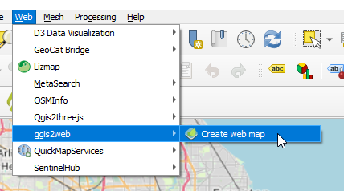

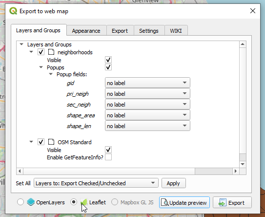

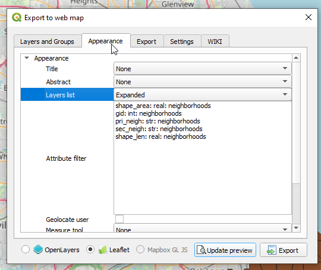

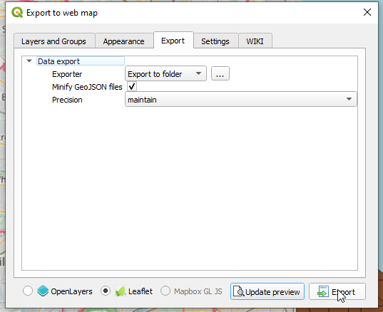

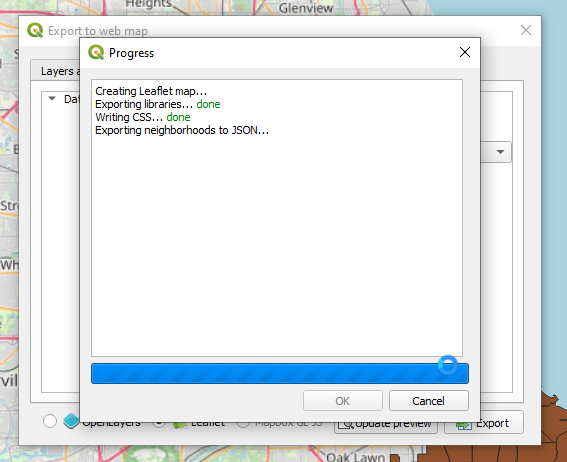

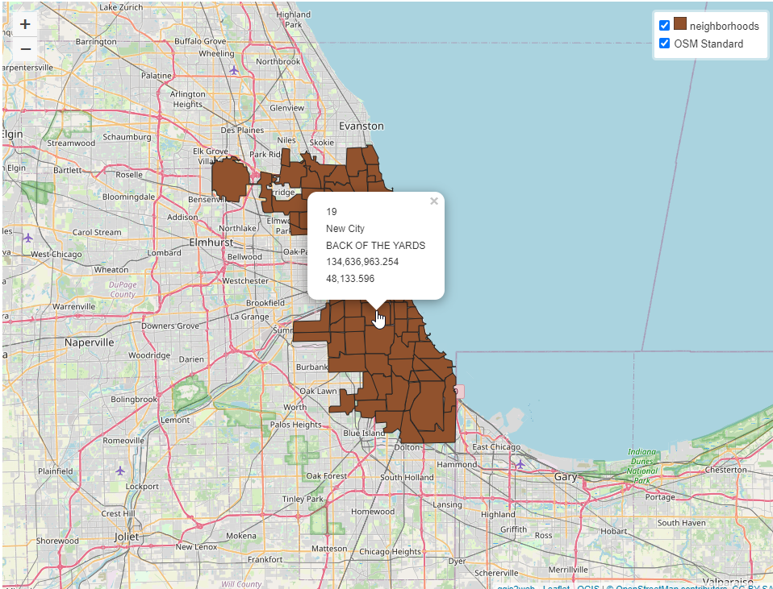

