.. This is a comment. Note how any initial comments are moved by
   transforms to after the document title, subtitle, and docinfo.

.. demo.rst from: http://docutils.sourceforge.net/docs/user/rst/demo.txt

.. |EXAMPLE| image:: static/yi_jing_01_chien.jpg
   :width: 1em

**********************
Publish a Project
**********************

.. contents:: Table of Contents

Publish
============

1. go to Groups and click on the "Add New Project" link for the Group you want to publis to.

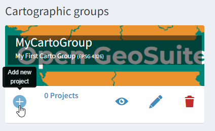

2. In the "New QGIS File" click "Choose File"

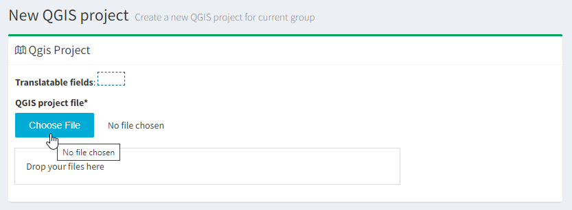

3. Navigate to the .qgis file on your desktop

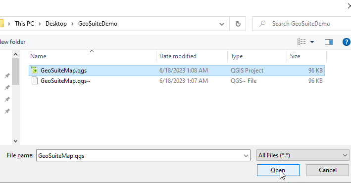

4. In the Description Data section, enter a name, a description and, optionally, a logo.  In the url slug field, enter 'cityparks'

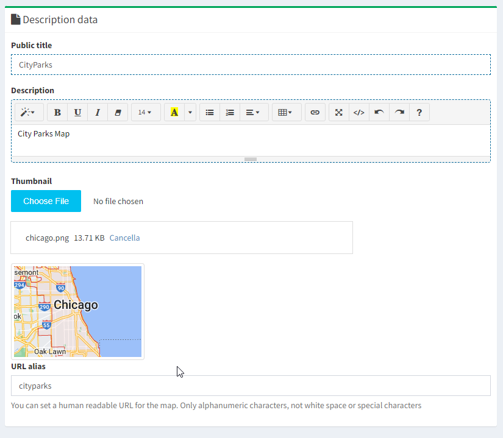

5. In the Options section, select Use QGIS Project map start as webgis init extent

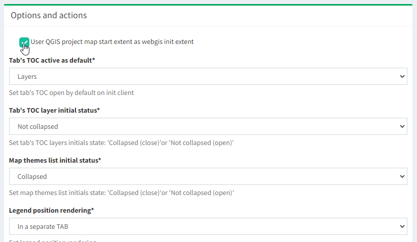

6. Click the Save button at bottom left

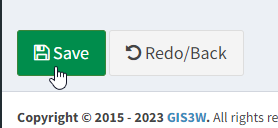

   
View Project
============

The Project should now appear as below.  Click the Show Map link to view your map

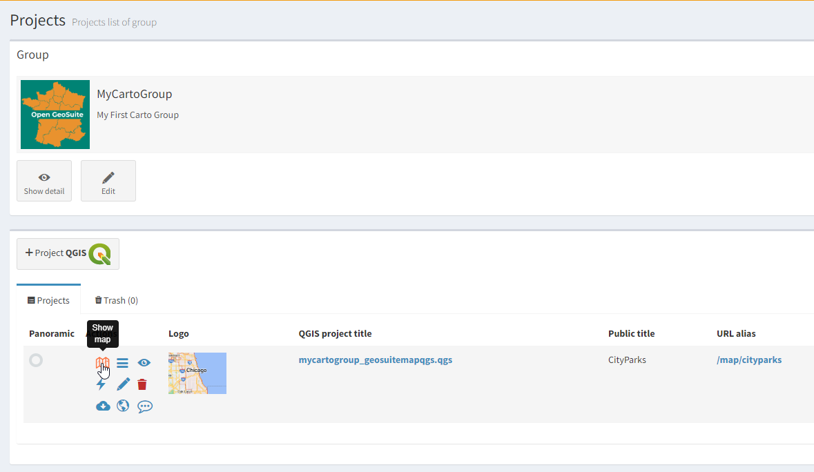

Your map should appear as below:

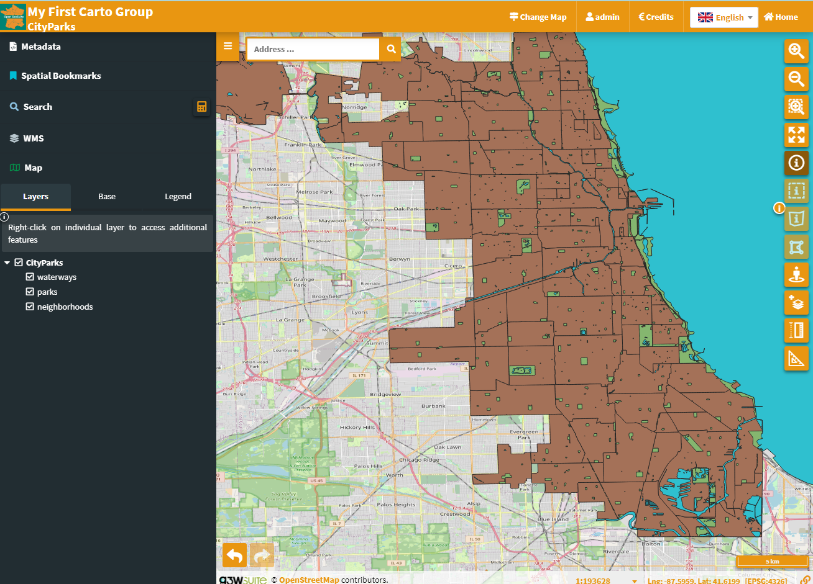

Test funcationality by click on the map to get feature info.  

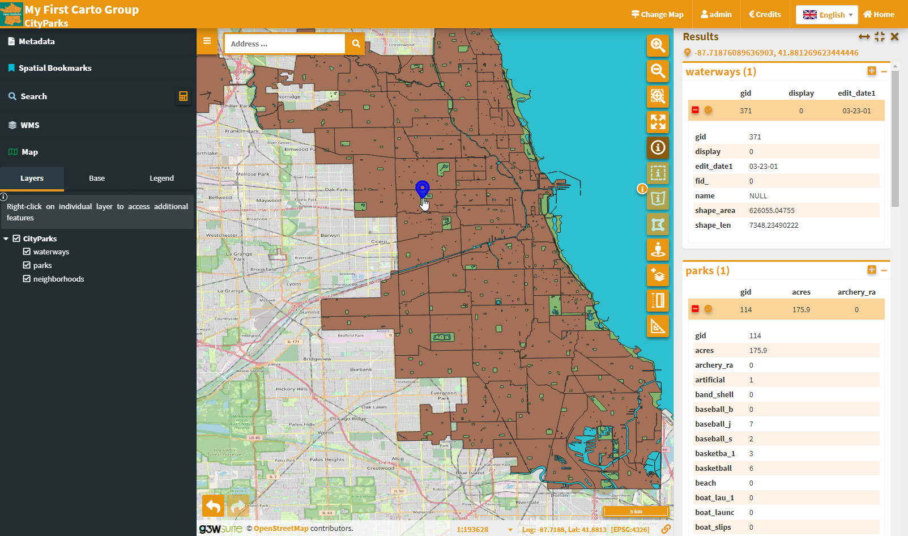

Right click on the neighborhoods node and select "Open Attribute Table":

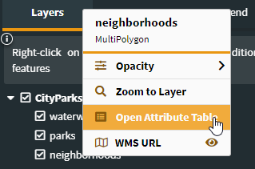

The attribute table should display as below and it should highlight layer area on mouse-over

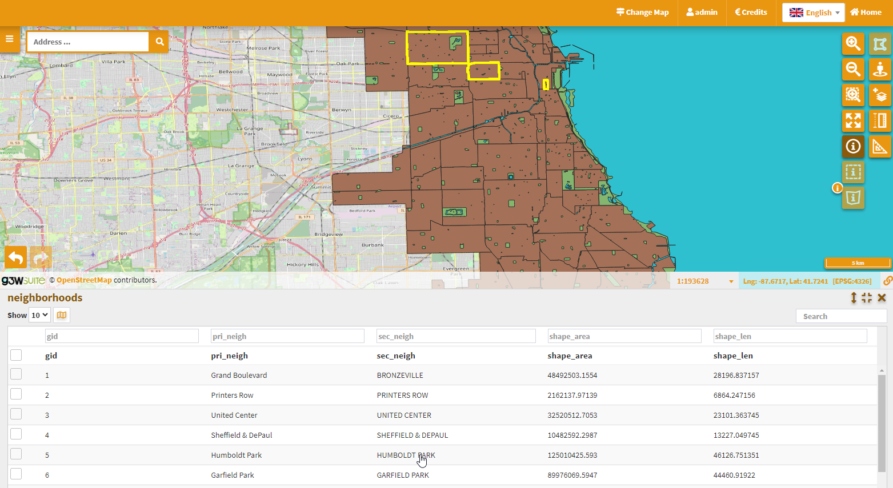

   
Database
=========

On installation, a database is created called postgisftw.  

This database contains the demo data.

A user pgis is also created and given permission to the database.  

The password for pgis is displayed at the end of installation as well as saved to /root/auth.txt

Functions
============

When loading data to any database for which you will use pg_tileserv, you MUST set a SRID

Without a declared SRID, pg_tileserv will not pick up the table.

.. image:: _static/set-SRID.png

 

 

