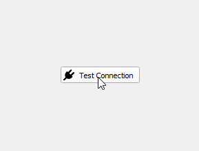
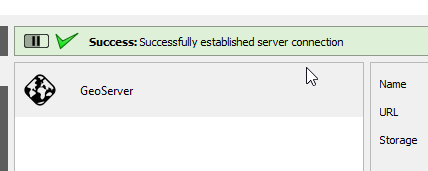
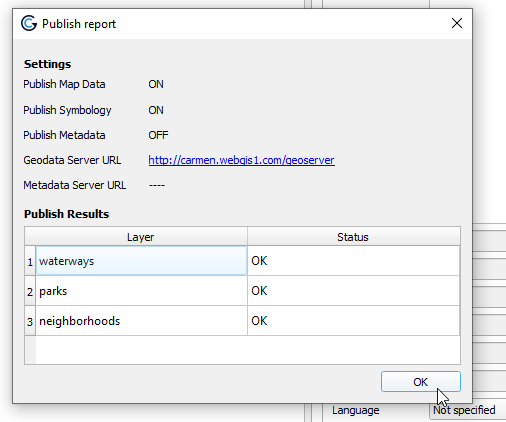
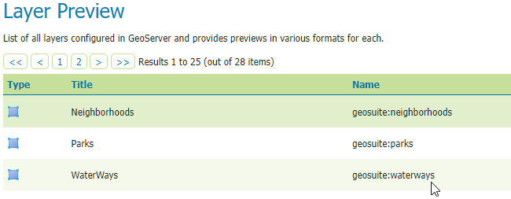
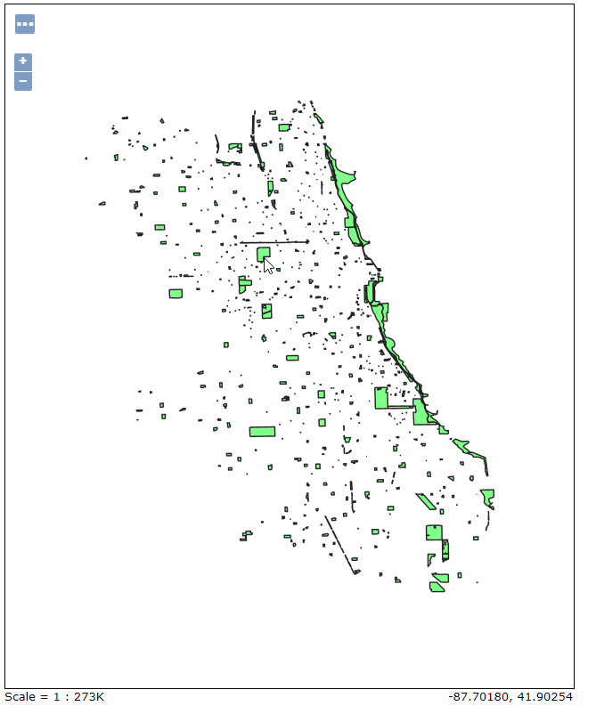
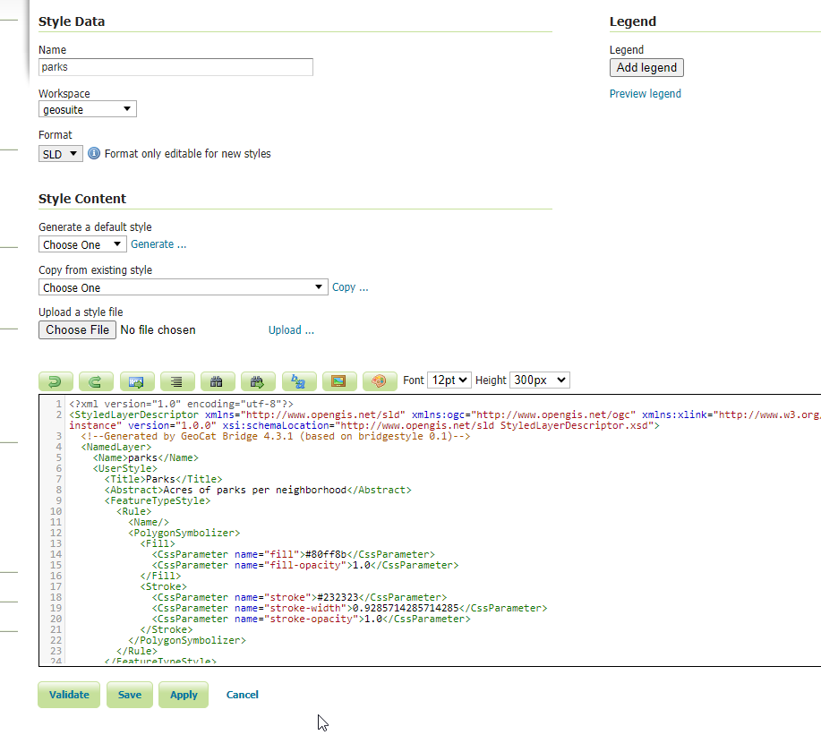

.. This is a comment. Note how any initial comments are moved by
   transforms to after the document title, subtitle, and docinfo.

.. demo.rst from: http://docutils.sourceforge.net/docs/user/rst/demo.txt

.. |EXAMPLE| image:: static/yi_jing_01_chien.jpg
   :width: 1em

**********************
Publish Layers
**********************

.. contents:: Table of Contents

Install GeoCat Bridge
======================

GeoCat Bridge is a free QGIS Plugin produced by GeoCat.

There are also advanced/premium editions as well.

To install the plugin:

**1. Go to Plugins on the top menu**

.. image:: _static/geocat-plugin-1.png

.. image:: _static/spacer.png

**2. Search for GeoCat**

.. image:: _static/geocat-plugin-2.png

.. image:: _static/spacer.png

**3. Select and click the Install Plugin button.**

GeoCat Bridgeshould now be available in the Web menu

Add Server
==============

**1. If not already open, open the GeoSuite.qgs project**

.. image:: _static/13-Add-Project.png

.. image:: _static/spacer.png

**2. In the top menu, go to Web > GeoCat > Publish**

.. image:: _static/geocat-1.png

.. image:: _static/spacer.png

**3. In the left menu, select Servers**

.. image:: _static/geocat-2.png

.. image:: _static/spacer.png

**4. Select GeoServer from the New Server dropdown at bottom**

.. image:: _static/geocat-3.png

.. image:: _static/spacer.png

**5. Enter a name and your GeoServer url.  We'll leave the rest as default for now.   Click the + button to add new authentication as shown below**.  

.. image:: _static/geocat-4.png

.. image:: _static/spacer.png

**6. In the authentication form, enter admin and your GeoServer admin password**

.. image:: _static/geocat-5.png

.. image:: _static/spacer.png

**7. Click Test Connection**

.. image:: _static/spacer.png

**8. Click Test Connection**

.. image:: _static/spacer.png

**9. Click the Save button at bottom right**

.. image:: _static/geocat-8.png

.. image:: _static/spacer.png

**10. Click the Publish tab on the left menu to display your QGIS project layers**

.. image:: _static/geocat-9.png

.. image:: _static/spacer.png

**11. On the Metadata tab at right, enter a name, abstract and any other parameters you wish to.  **

.. image:: _static/geocat-10.png

.. image:: _static/spacer.png

**12. Repeat above for each layer**

.. image:: _static/geocat-10-2.png

.. image:: _static/spacer.png

**13. Click the Publish button at bottom:**

.. image:: _static/geocat-12.png

.. image:: _static/spacer.png

**14. The publication process will display as below**

.. image:: _static/geocat-13.png

.. image:: _static/spacer.png

**15. Upon completetion you should see the status for each layer:**

.. image:: _static/spacer.png

  
View Layers
============

**1. Navigate to your GeoServer instance and click on Layers**

**2.  Your layers should now appear as below:**

.. image:: _static/spacer.png

.. Note:: When publishing layers to GeoServer using GeoCat Bridge, a new workspace is created using the name of qgs project file.  As you can see above, workspace 'geosuite' was created and our layers were published to this workspace.

Styles
============

One of the best features of GeoCat Bridge is that it published Styles along with the layers.

As we can see below, our Parks is using the style we selected in QGIS

.. image:: _static/spacer.png

The Styles can be viewed and edited in the Style menu:

.. image:: _static/spacer.png

Publish Styles Only
===================

If we wish to, we can publish only the styles.  We'll cover this in the next section

Summary
============

We installed GeoCat bridge in QGIS and used it to publish our PostGIS layers to GeoServer.

 

 

