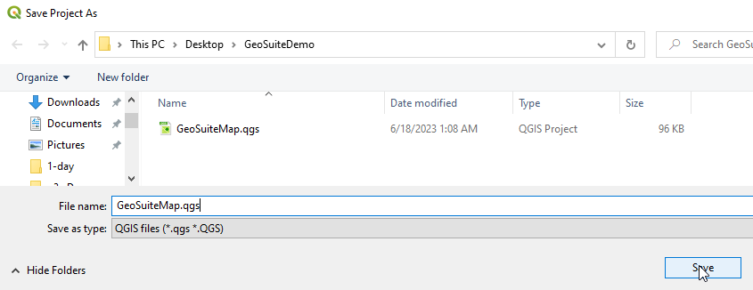
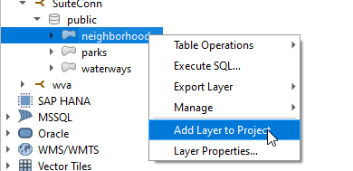
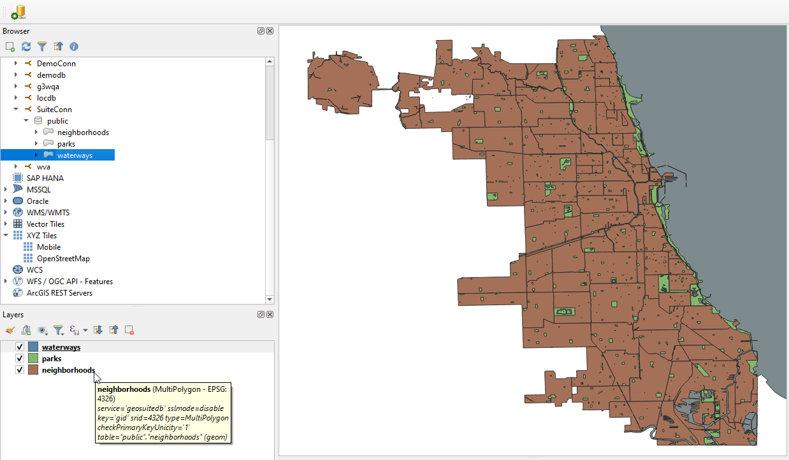
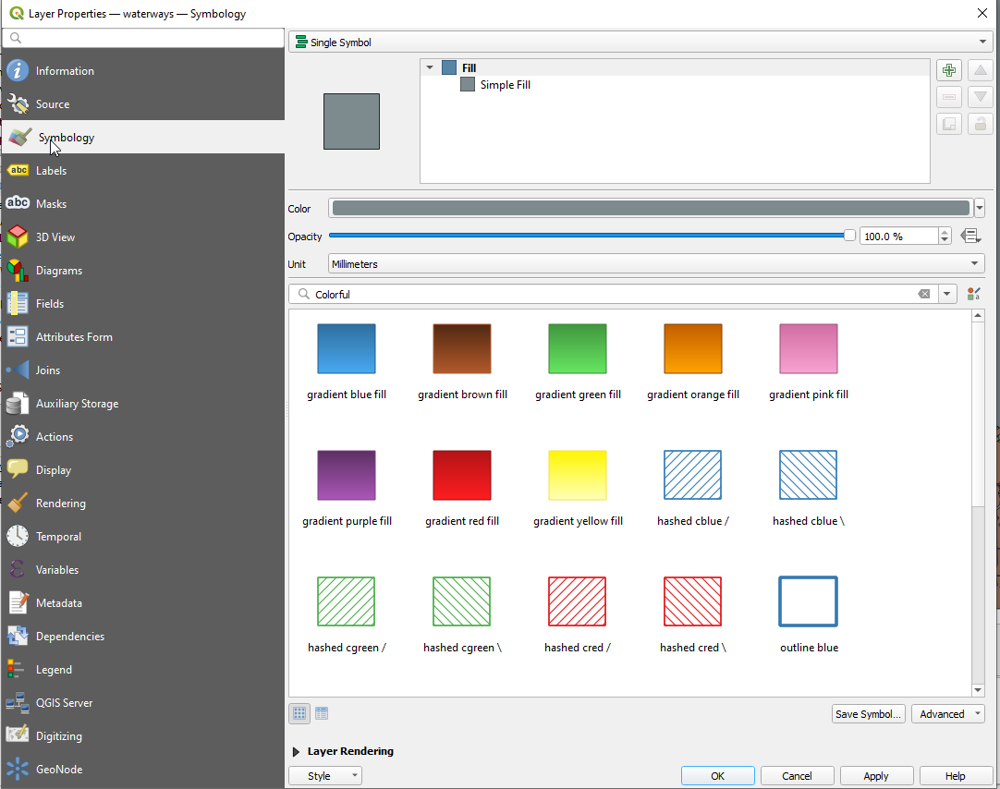
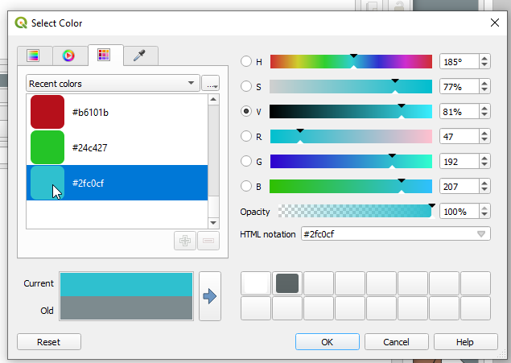
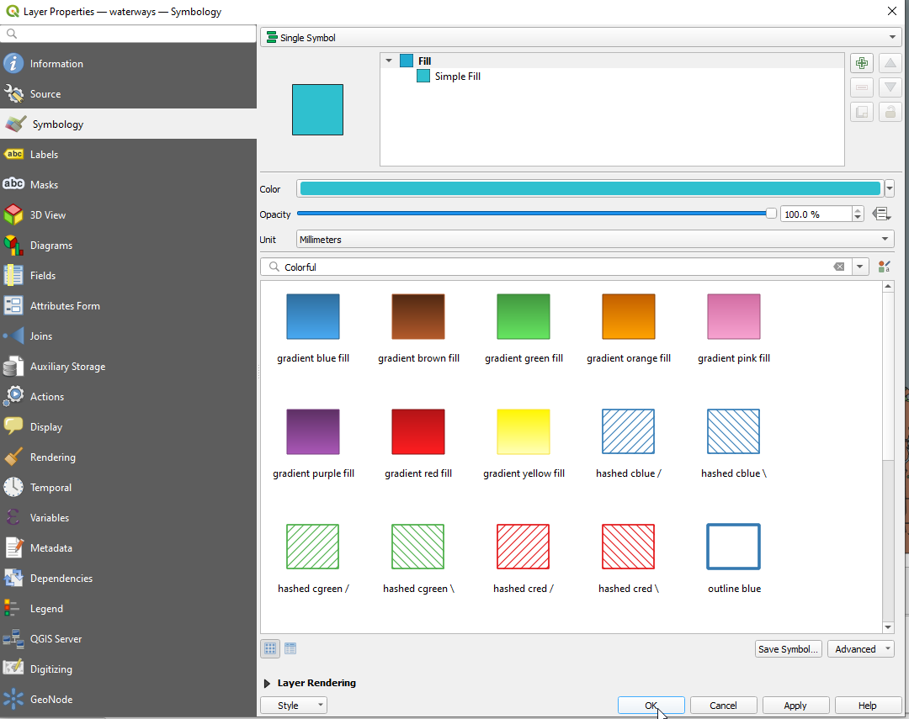

.. This is a comment. Note how any initial comments are moved by
   transforms to after the document title, subtitle, and docinfo.

.. demo.rst from: http://docutils.sourceforge.net/docs/user/rst/demo.txt

.. |EXAMPLE| image:: static/yi_jing_01_chien.jpg
   :width: 1em

**********************
Create a QGIS Project
**********************

.. contents:: Table of Contents

Create Project
==================

Open QGIS and under the Project menu, select New

.. image:: _static/qgis-project-new.png

.. image:: _static/spacer.png

Save your project with the .qgis extention

.. image:: _static/spacer.png

Add PostGIS Layers
==================

If you didn't already do so in the previous section, create the PostGIS connection using your pg_service.conf file.

**1. Expand the PostGIS node in the left menu**

.. image:: _static/30-qgis-3.png

.. image:: _static/spacer.png

**2.  Expand the SuiteConn connection we created earlier**

.. image:: _static/30-qgis-4.png

.. image:: _static/spacer.png

**3.  Right click on the neighborhoods node and click "Add Layer to Project"**

.. image:: _static/spacer.png

**4.  The neighborhoods layer is added to our map canvas.**

.. image:: _static/30-qgis-6.png

.. image:: _static/spacer.png

**5.  Repeat step 3 above to add the parks and waterways layers**

.. image:: _static/spacer.png

The three PostGIS layers we added are now added to map canvas

Style
============

As shown, the waterways layer is grey.

Let's change that to blue.

**1.  Open the layer Properties by double clicking the layer or right click and select Properties**

.. image:: _static/style-layer.png

.. image:: _static/spacer.png

**2.  Select Symbology on the left menu.** 

.. image:: _static/spacer.png

**3.  Click the color selector to open the Color Palette.  Select a blue color and click OK**

.. image:: _static/spacer.png

**4. The color selector should now reflect the color selection**

.. image:: _static/spacer.png

**5.  Our waterways layer should now reflect the blue color you selected**

.. image:: _static/30-qgis-11.png

.. image:: _static/spacer.png
   
Save 
============

Save your changes by going to Project > Save
   
**Congradulations, you have created a QGIS project map.**

 

