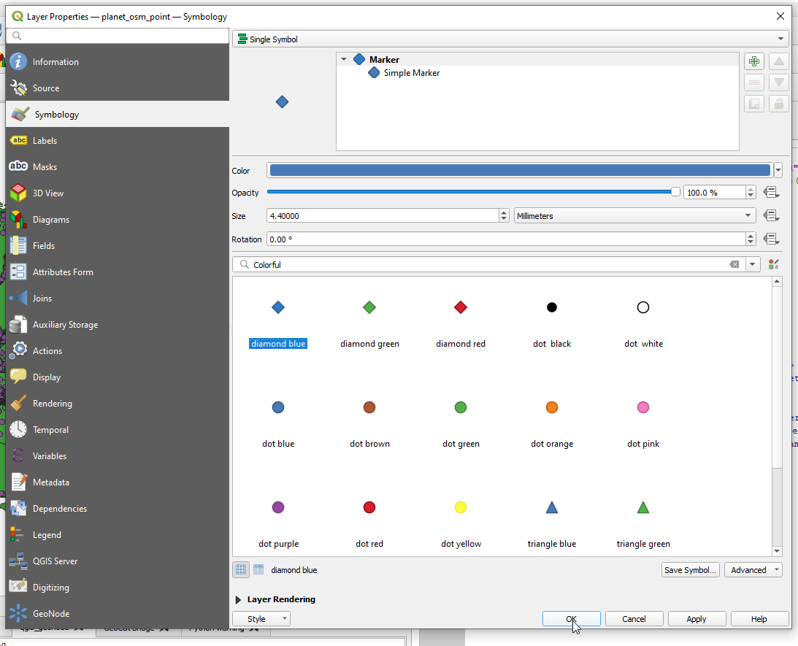
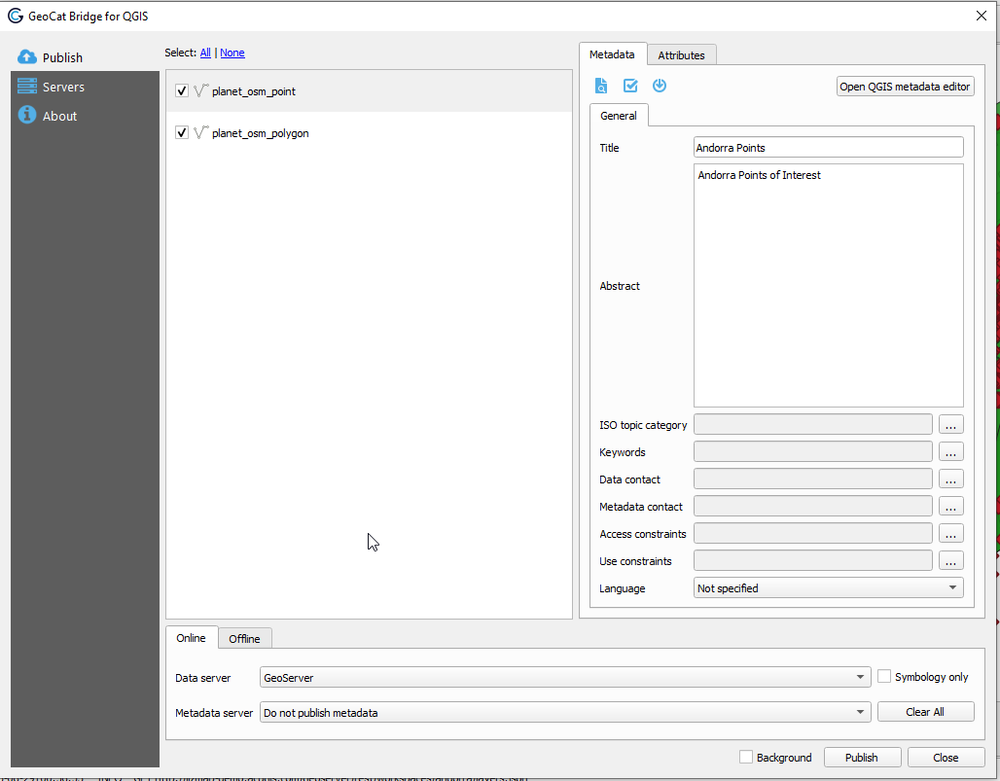
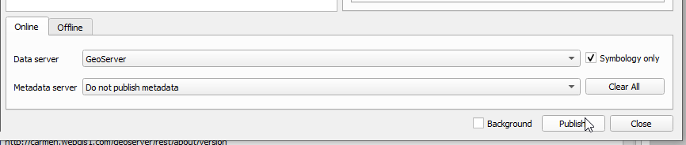
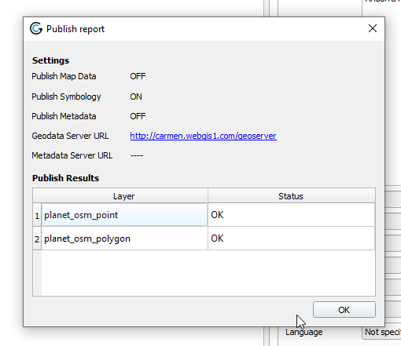
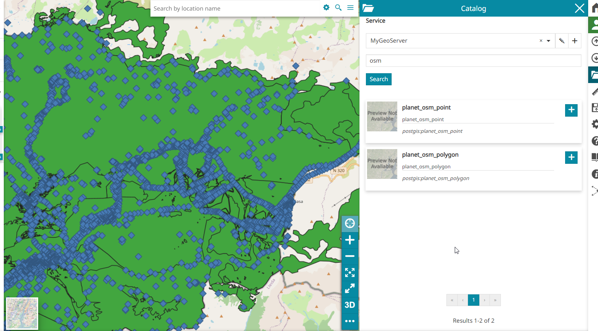

**********************
Publish Styles Only
**********************

.. contents:: Table of Contents

Add Layers to QGIS
======================

Previously, we used osm2pgsql to import a PBF file to our PostGIS database.

However, we never published the layers created to GeoServer.

**1. Create a new qgis project, andorra.qgs**

**2. Expand the geosuite PostGIS connection**

.. image:: _static/1-andorra.png

.. image:: _static/spacer.png

**3. Add the planet_osm_polygon layer to the project**

.. image:: _static/2-andorra.png

.. image:: _static/spacer.png

**4. Add the planet_osm_points layer to the project**

.. image:: _static/3-andorra.png

.. image:: _static/spacer.png

Create Styles
==========================

**1. In the top menu, go to Web > GeoCat > StyleViewer**

.. image:: _static/5-andorra.png

.. image:: _static/spacer.png

**2. As shown below, the SLD style for our layer is displayed**

.. image:: _static/4-andorra.png

.. image:: _static/spacer.png

**3. Double click the planet_osm_polygon layer to open the Properties box**

.. image:: _static/7-andorra.png

.. image:: _static/spacer.png

**4. On the Symbology section, select a new fill color and click Save**

.. image:: _static/8-andorra.png

.. image:: _static/spacer.png

**5. Our new polygon style is updated as below**

.. image:: _static/10-andorra.png

.. image:: _static/spacer.png

**6. Repeat for the planet_osm_points layer, selecting 'Blue Diamond'**

.. image:: _static/spacer.png

**7. Again, we see the SLD style for the layer is displayed on save**

.. image:: _static/good-no-2.png

.. image:: _static/spacer.png

Publish Styles
==========================

**1. As before, go to Web > GeoCat > Publish**

.. image:: _static/spacer.png

**2. In order to publish only our styles to GeoServer, tick the "Symbology only" checkbox and then click Publish**

.. image:: _static/spacer.png

**3. We should see a success message like below**

.. image:: _static/spacer.png

Set Styles in GeoServer
==========================

**1. Log in to GeoServer and click Add New Layer**

.. image:: _static/layer-1.png

.. image:: _static/spacer.png

**2. Click the publish links for planet_osm_polygon and planet_osm_points layers from our PostGIS store**

.. image:: _static/publish-andorra-1.png

.. image:: _static/spacer.png

**3. Go to Layers and select the planet_osm_polygon layer**

.. image:: _static/publish-andorra-2.png

.. image:: _static/spacer.png

**4. On the Publish tab, select the green polygon style we uploaded above**

.. image:: _static/publish-andorra-3.png

.. image:: _static/spacer.png

**5. Repeat for the planet_osm_points layer**

.. image:: _static/publish-andorra-4.png

.. image:: _static/spacer.png

**6. The styles we created in QGIS and uploaded using GeoCat Bridge are now applied**

.. image:: _static/spacer.png

Summary
============

We used GeoCat bridge to upload styles we created in QGIS and applied the styles in GeoServer

 

 

