.. This is a comment. Note how any initial comments are moved by
   transforms to after the document title, subtitle, and docinfo.

.. demo.rst from: http://docutils.sourceforge.net/docs/user/rst/demo.txt

.. |EXAMPLE| image:: static/yi_jing_01_chien.jpg
   :width: 1em

**********************
Tools
**********************

.. contents:: Table of Contents

G3W-Suite contains a large amount of tools, widgets, and functions.

Spatial Bookmarks
==================

**1. Click on Spatial Bookmarks in the left menu**

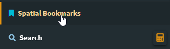

.. image:: _static/spacer.png

**2. Click the + button to add a new Spatial Bookmark**

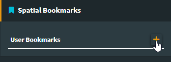

.. image:: _static/spacer.png

**3. Position the map where you want to locate the bookmark and click the "Add" button**

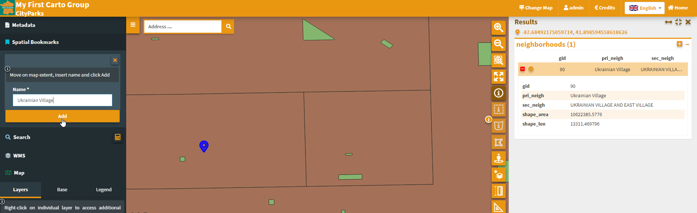

.. image:: _static/spacer.png

**4. The bookmark has been added and is available under the Spatial Bookmarks tab.**

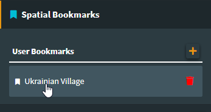

.. image:: _static/spacer.png

**5. Clicking the bookmark will take you to the bookmarked location**

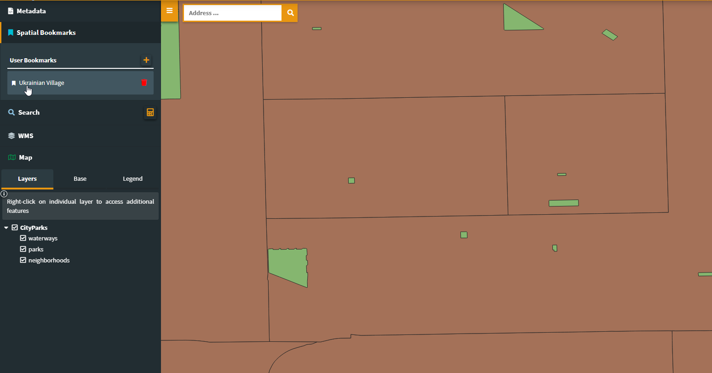

.. image:: _static/spacer.png

   
Search Query
==============

**1. Click the Query Builder icon in the left menu**

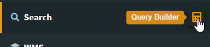

.. image:: _static/spacer.png

**2. Select neighborhoods from the layer dropdown**

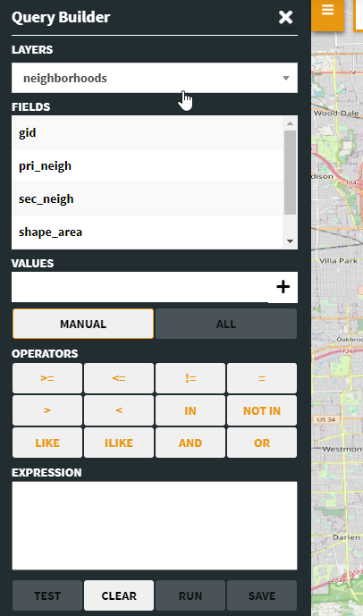

.. image:: _static/spacer.png

**3. Enter a query.  Below we are looking for neighborhoods with areas above 15888550.  Click the Test button to see if results are returned**

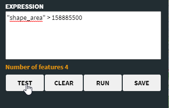

.. image:: _static/spacer.png

**4. On the right hand menu, you should see the query results.**

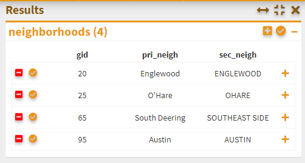

.. image:: _static/spacer.png

**5. Click Save to save the query**

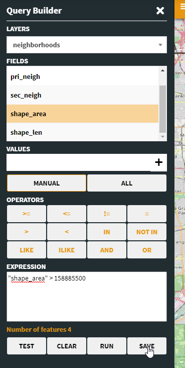

.. image:: _static/spacer.png

**6. Give the query a name**

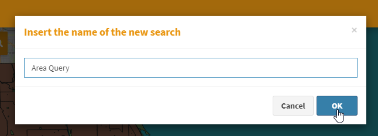

.. image:: _static/spacer.png

**7.  Clicking the query will now show the results**

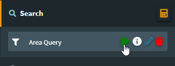

.. image:: _static/spacer.png

   
WMS
==============

**1. Click the WMS icon in the left menu.  Give the WMS service a name, enter the url, and click the + button.  Below, we are using the CONUS NEXRAD Base Reflectivity (n0q) (https://mesonet.agron.iastate.edu/cgi-bin/wms/nexrad/n0q.cgi?)**

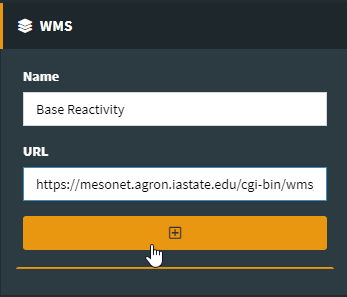

.. image:: _static/spacer.png

**2. Select layer(s) to add, along with the Projection, and a name.  Click the + button**

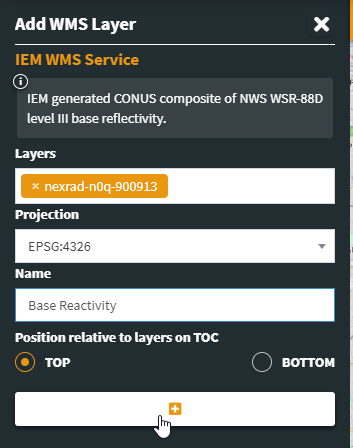

.. image:: _static/spacer.png

**3. The WMS layer(s) is now added as below**

.. image:: _static/wms-3.png

.. image:: _static/spacer.png

**4. The service is now listed under WMS on the left menu.  You can add multiple services and layers**

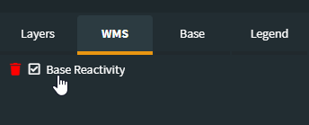

.. image:: _static/spacer.png

Nominatim Search
=================

**At the top left of the map is a Nomimatim search box:**

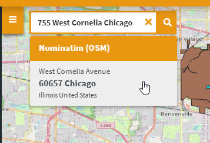

.. image:: _static/spacer.png

 

 

