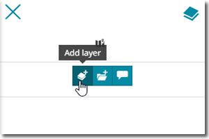
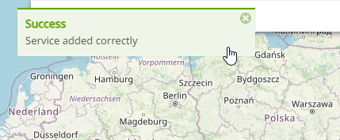
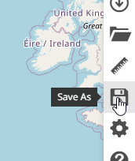
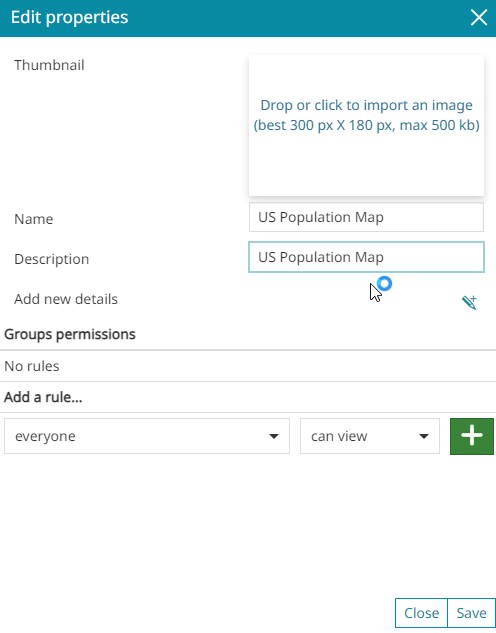
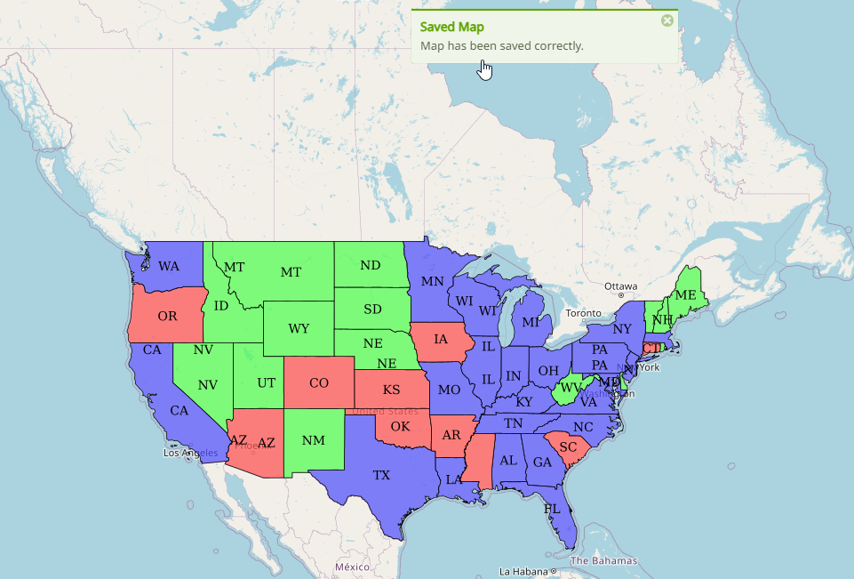

Create a Map
-------------
\
To create a map in Mapstore2

**1. Click the "New Map" icon as shown below**

.. image:: _static/mapstore-2.png

**2. Click the "Layers" icon as shown below.**

.. image:: _static/mapstore-3.png

**3. Click the "Add Layers" icon as shown below**
 

**4. On the right side Catalog menu, click the "+" button to add your GeoServer WMS url**

.. image:: _static/mapstore-6.png

 
\ 
**5. Enter your GeoServer URL and clck Save**

.. image:: _static/mapstore-7.png  

\  
**6. You should see a message at center confirming it's been saved.**  

 
\ 
**7. Now, select the WMS service you just entered from the dropdown**  

.. image:: _static/mapstore-9.png  

\ 
**8. In the Search field, enter "Population" to locate the US Population layer from GeoServer**  

.. image:: _static/mapstore-10.png  

\ 
**9. Click the "Add to Map" button to add the layer to your map**  

.. image:: _static/mapstore-11.png

\ 
**10. Your layer should now appear on the map as below**

.. image:: _static/mapstore-12.png

\ 

**11. Test FeatureInfo by clicking on the map to see features displayed**

.. image:: _static/dashboard-features.png

**12. On the right side menu, click the "Save As" icon**

\ 
**13. Enter a name and description and, optionally, a thumbnail.**

\ 
**14. Set any permissions you wish to.  Here, we are giving access to the Public**

.. image:: _static/mapstore-15.png

\ 
**Congradulations!  You've created your first Mapstore2 map using your GeoServer instance**.

