*******
Maps
*******

The Maps page allows you to create and edit Maps.

.. contents:: Table of Contents

Create Map
===================================

To create a Map, click on "Add New" button.

   .. image:: images/Add-Map.png

There are two options for creating a Map.

Option 1: FTP.
------------

FTP Uploads are qgis2web maps you have uploaded directly via FTP.

It can also maps you uploaded via any FTP client.

   .. image:: images/Map-2.png

Option 2: Archive (Upload)
------------

Archive is a zipped archive file you can upload.

   .. image:: images/Map-3.png

Map Options
===================================

Below are the options availble for each map.

Name
--------------

Give your map a name.  The name will appear as the map title on the dashboard.

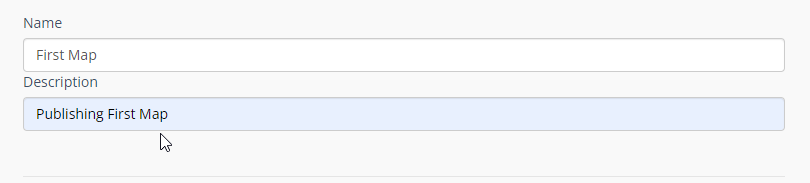

Description
--------------

The Description is the text that will appear at the bottom of the map link

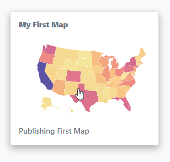

Data
--------------

The Data section is where you can connect your map layers to their Data Sources to make them dynamic.

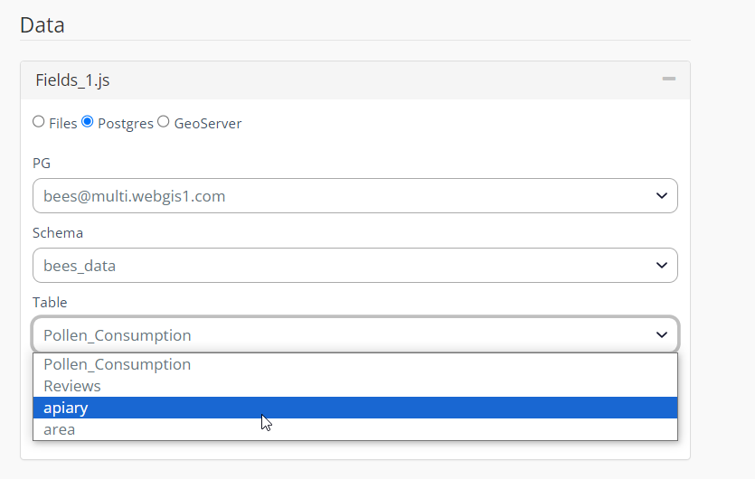

Layer Cache
--------------

When you connect your map to a PostGIS Data Source, you have the option of caching layers for better performance.

By default, cache is disabled.

You can enable caching on a per Layer basis by specifying the cache interval.

When set, this is the interval at which your map will check the database for updates.

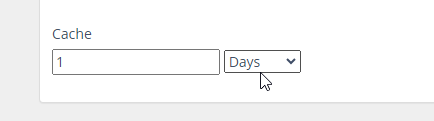

If you have enabled cache and wish to clear it, you can do so by clicking the Clear Cache icon on the Map page:

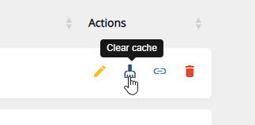

QGIS Project File:
--------------

You can upload your QGIS Project file in order to use WMS, WFS, and WMTS

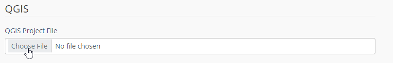

Map CSS:
--------------

Enter any custom CSS for your map that wish to.

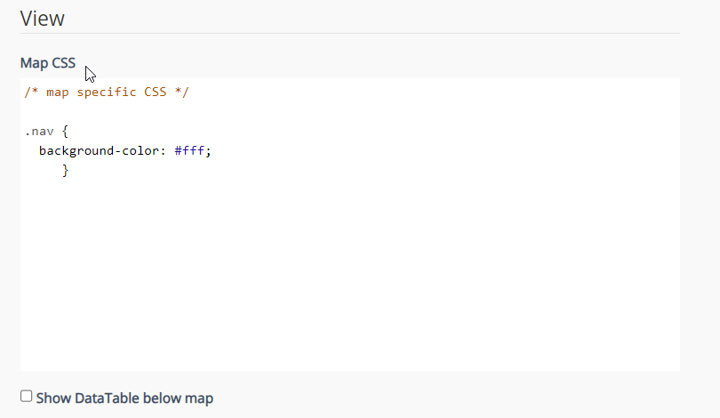

Thumbnail Image:
--------------

Upload a thumbnail image for your map to be displayed on the home page.

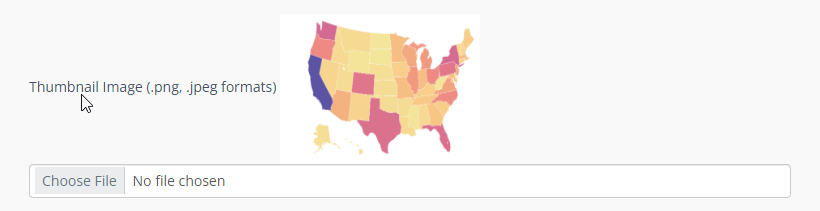

Data Tables:
--------------

Check the "Show Data Tables" box in order to provide users with data in table format.

.. image:: images/Show-Data-Table.png

Info Box.
--------------

The InfoBox is a modal information box you can display to map users.

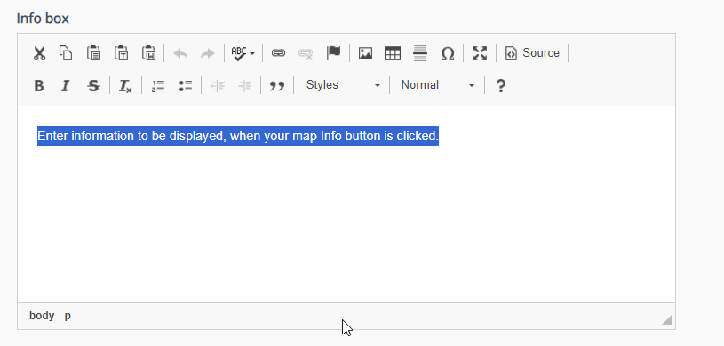

Security
--------------

Maps can be Private or Public.

The Security section is where you assign permissions to your map.

Security is Group based, so any users belonging to the Group will be able to view the map.

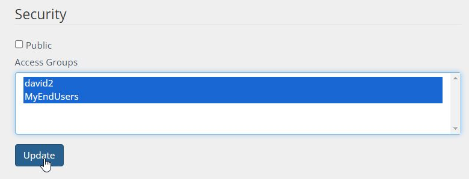

1. Private Maps

Private maps can be viewed by the user logging into your map portal or via Secure Share link (for temporary access)

For example, since we gave access to the Group containing user Jane Doe, when she logs in she will see only the two maps she has permissions to

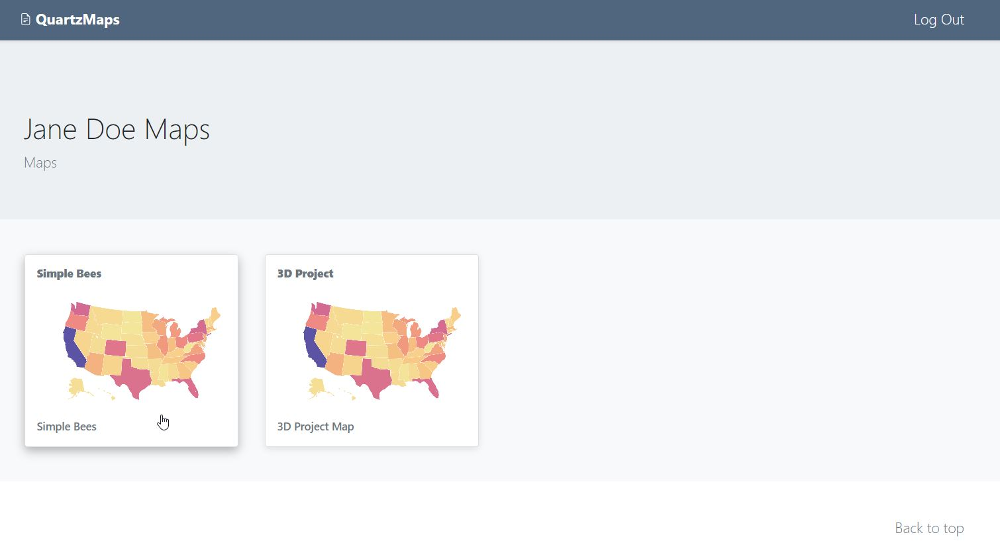

2. Public Maps

You can also tick the “Public” box to make your map public.

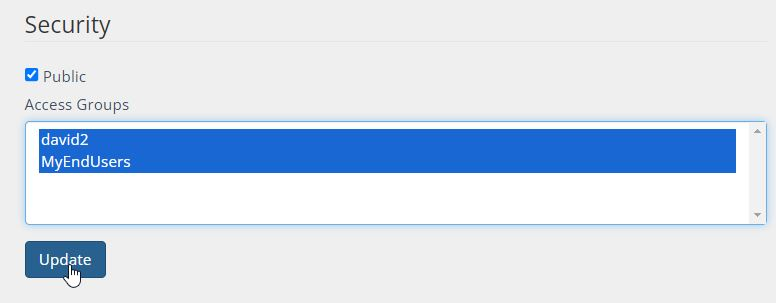

If your map is “Public”, you can use the map url to display the map.

By default, the map is full screen. You can also use an iframe like below:

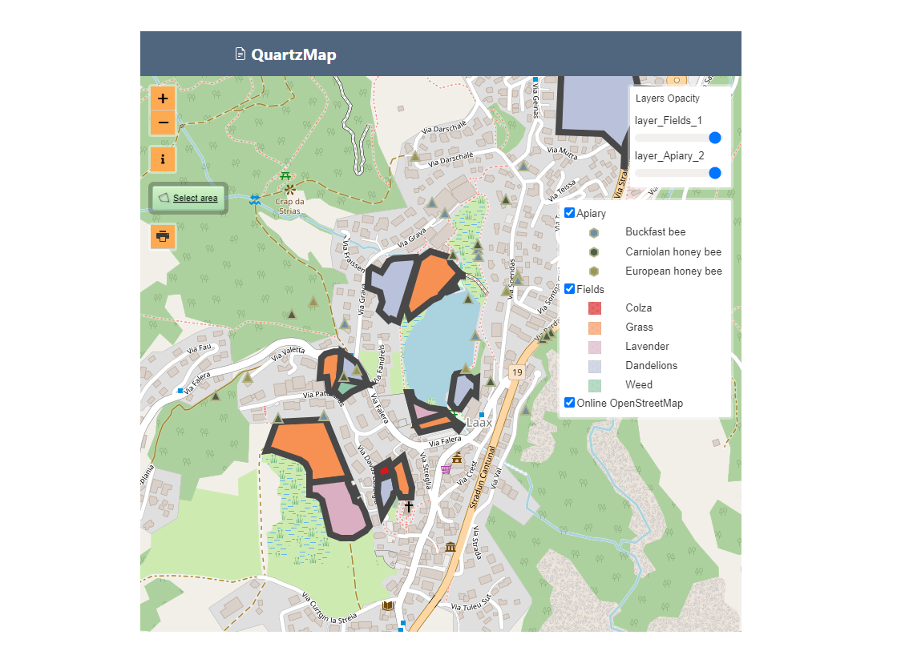

