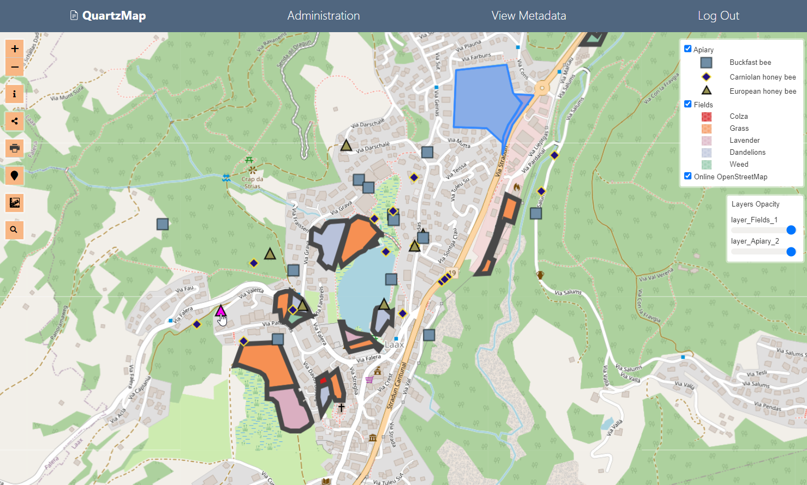
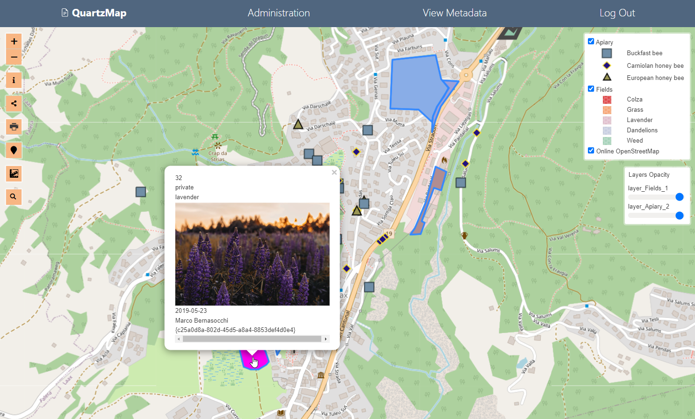

Connect to PostGIS
======================

This section is a Quick Start to connecting your published maps to their original Data Source to make them dynamic.

You can connect to a PostGIS Data Source or GeoServer Data Source.

1. Go to Connections
---------------------------

On the Connections page, enter the connection details for your PostGIS or Server connection(s)

  .. image:: images/PostGIS-Add-Connection.png

2. Go to Maps and click the edit link
---------------------------

  .. image:: images/Dynamic-1.png

3. In Data section click on layer
---------------------------

 .. image:: images/Dynamic-2.png

 
4. Select Connection, Schema, and Table
---------------------------

 .. image:: images/PostGIS-Select.png

.. note::
    Optionally, you can set Caching for each layer.  Cache can be cleared via the Clear Cache link on the Map page or by disabling Cache.   

Click the Update button.

That's it!
~~~~~~~~~~~~~

Your map is now connected to your original Data Source and is fully dynamic.

To test, try editing or udpating some data

