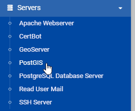

Control Panel
-------------

To access the control panel login, click the login link on the top menu:

.. image:: _static/control-panel-start.png

.. image:: _static/spacer.png

The Control Panel can also be accessed directly via::

https://yourdomain.com:10000

The user is root and the password is your root password

.. image:: _static/Login.png

.. image:: _static/spacer.png

Once logged in, the GeoServer, PostGIS, and Certbot modules are accessible on the left menu under Servers:

.. image:: _static/spacer.png

The PostGIS section appears as below and will be covered in subsequent sections:

.. image:: _static/geoserver-panel-1.png

.. image:: _static/spacer.png

The GeoServer section appears as below and will be covered in subsequent sections:

.. image:: _static/geoserver-panel-2.png

.. image:: _static/spacer.png

Removing the Control Panel
-------------------------

If you do not wish to use the control panel for any reason, it can be removed using below.

Removing the control panel has no effect on any of the components (PostGIS, GeoServer, etc...)

.. code-block:: console
   
   root@suite:~# ./etc/webmin/uninstall.sh

