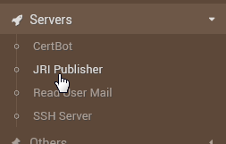
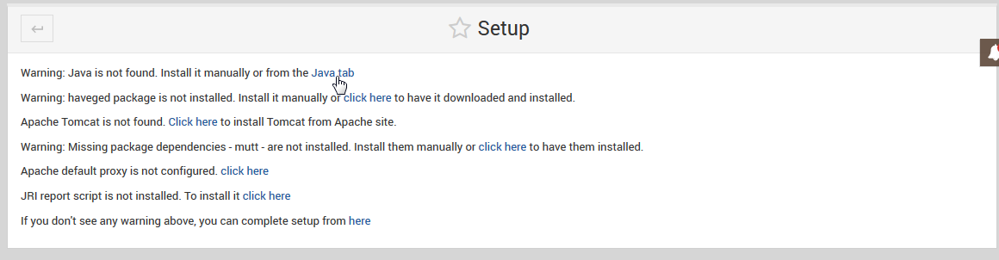
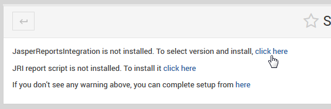
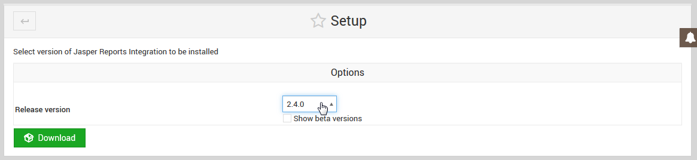
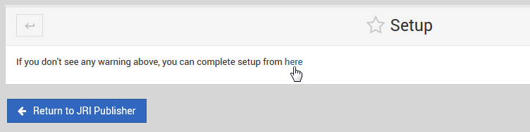

.. _wizard-label:

************
Wizard
************

Once the module is installed, the Wizard is used to configure the components.

Go to Servers > JRI Publisher:

The main Wizard screen will a link for completing each step.

While most steps are self-explanatory, we will cover Tomcat, JDK, and JRI selection below:

**Install Java/JDK:**

Select the JDK you wish to use.  We have tested with JDK 8

.. image:: _static/5-java.png

JRI Publihsher has been tested with OpenJDK 8 and Oracle JDK 8.

**Apache Tomcat:**  

.. image:: _static/8-tomcat.png

JRI Publihsher has been tested with Apache Tomcat 8.x and 9.x:

.. image:: _static/9-tomcat.png

**Install JasperReportsIntegration:**

JRI Publihsher has been tested with JasperReportsIntegration 2.4.0 and 2.5.1:

.. note::
    If you wish to use a Beta version of JasperReporsIntegration, tick the "Show Beta Versions" select box 

 
Once each step of the Wizard is completed, the Wizard can be removed:

With the Wizard completed, your module should appear as below:

.. image:: _static/start-jri.png

.. note::
    The JRI application is not deployed at this point.  You need to Start Tomcat
    in order to deploy it.  Do so before any further operations as it is required
    to write configuration files, etc...
    

About Haveged
===================

Haveged is an entropy generator that will provide markedly faster JVM startup times.
The caveat is that it will use much higher CPU load (although for shorter duration due
to decreased JVM start up time).  Bear this in mind if deploying on VM with limited CPU
or other critical applications.

